# platformer-prototype · Code Wiki

> 面向《游戏策划 / 游戏引擎设计 / 交互设计概论》学期课程的 **Unity 2D 平台跳跃原型**。
> 本文档对项目整体架构、主要模块职责、关键类与函数、依赖关系、运行方式做结构化梳理。

---

## 目录

1. [项目概览](#1-项目概览)
2. [技术栈与依赖](#2-技术栈与依赖)
3. [目录结构](#3-目录结构)
4. [整体架构与数据流](#4-整体架构与数据流)
5. [核心框架层 Prototype.Core](#5-核心框架层-prototypecore)
6. [玩法系统层 Prototype.Gameplay](#6-玩法系统层-prototypegameplay)
7. [UI 系统层 Prototype.UI](#7-ui-系统层-prototypeui)
8. [特效与音频层 Prototype.Effects / Prototype.Audio](#8-特效与音频层-prototypeeffects--prototypeaudio)
9. [编辑器工具层 Prototype.Editor / Prototype.Verification](#9-编辑器工具层-prototypeeditor--prototypeverification)
10. [关键类与函数速查](#10-关键类与函数速查)
11. [事件索引与跨模块通信](#11-事件索引与跨模块通信)
12. [项目运行方式](#12-项目运行方式)
13. [设计要点与约定](#13-设计要点与约定)

> **图表索引（Mermaid）**：分层架构图(4.1)、三层职责边界图(4.1.2)、收集通关时序图(4.2.1)、受伤死亡时序图(4.2.2)、关卡生命周期状态图(4.2.3)、事件订阅生命周期(4.2.4)、核心层职责图(5.0)、玩法层子组结构图(6.0)、跳跃手感时序图(6.1.1)、连击状态图(6.1.2)、UI 层数据流图(7.0)、特效音频层资源与调用图(8.0)、编辑器层工具结构图(9.0)、跨模块依赖图(11.2.1)、事件发布订阅关系图(11.2.2)、Unity Editor 安装流程图(12.2.1)、依赖检查清单(12.2.4)、首次运行流程图(12.3.1)、场景搭建时序图(12.3.2)、构建可执行文件流程图(12.6)、克隆仓库时序图(12.7)

---

## 1. 项目概览

| 项 | 值 |
|---|---|
| 项目名 | platformer-prototype（2D 平台跳跃原型） |
| 引擎 | Unity 2022.3.62f3c1 |
| 语言 | C# |
| 顶层命名空间 | `Prototype` |
| 代码文件 | 26 个 C# 脚本（运行时 19 + 编辑器 7） |
| 场景 | `Main.unity`（关卡）+ `Result.unity`（结算） |
| 美术资源 | Kenney Pixel Platformer（CC0 授权） |
| 音频 | 全部程序化合成（正弦波），无外部音频文件 |
| 物理 | `Rigidbody2D` + `BoxCollider2D`（图层 `Ground`） |
| 版本控制 | git + jj（双重 VCS） |

**项目定位**：从私有脚手架《Unity 原型脚手架》（3D，基于 `CharacterController`）合并并适配为 2D（基于 `Rigidbody2D`）。`Core/` 与 `UI/` 为引擎无关逻辑，原样保留；`Gameplay/` 重写为 2D。

---

## 2. 技术栈与依赖

### 2.1 Unity Packages（`Packages/manifest.json`）

| 包 | 用途 |
|---|---|
| `com.unity.modules.physics` | 3D 物理（脚手架遗留） |
| `com.unity.modules.physics2d` | **2D 物理（核心：Rigidbody2D / BoxCollider2D / Physics2D）** |
| `com.unity.modules.ui` + `com.unity.ugui` | uGUI（HUD/结算用 `Text`/`Image`/`Button`） |
| `com.unity.modules.uielements` | UI Elements |
| `com.unity.modules.audio` | 音频（`AudioSource` / `AudioClip`） |
| `com.unity.modules.animation` | 动画 |
| `com.unity.modules.particlesystem` | 粒子 |
| `com.unity.modules.imgui` | 即时模式 GUI（编辑器） |

### 2.2 外部资源

- **Kenney Pixel Platformer**（CC0，https://kenney.nl/assets/pixel-platformer ）：501 个像素精灵文件，由 `PixelSprites.cs` 统一导入（Point 过滤、关闭压缩与 mipmap，保持像素锐利）。
- **无第三方代码库**：所有玩法逻辑为自研，无 NuGet / UPM 第三方代码包。

### 2.3 引擎 API 约定

- 地面检测统一用 `Physics2D.Raycast` + `LayerMask("Ground")`。
- 玩家对象标签为 `"Player"`，收集物标签可选 `"Collectible"`。
- 单例通过自研 `MonoSingleton<T>`，不依赖引擎全局单例。

---

## 3. 目录结构

```
platformer-prototype/
├─ Assets/
│  ├─ Art/                  # Kenney 像素素材（Tiles/Characters/Backgrounds + Generated 拼合纹理）
│  ├─ Audio/                # （空，音效全部程序化生成）
│  ├─ Editor/               # 编辑器工具（7 个 C# 脚本）
│  │  ├─ SceneSetupHelper.cs        # 一键搭建 Main/Result 场景（M1 关卡设计）
│  │  ├─ SceneSetupPrimitives.cs    # 场景搭建通用图元工厂
│  │  ├─ PixelSprites.cs            # 像素素材加载器 + 拼合长条纹理
│  │  ├─ Platformer2DSettings.cs    # 首次打开强制 Default Behavior Mode = 2D
│  │  ├─ AutoTestMenu.cs            # 菜单：自动通关测试入口
│  │  ├─ AutoTestLauncher.cs        # Play 模式监听（已停用劫持逻辑）
│  │  └─ M1ClosureVerifier.cs       # M1 通关闭环验证器（PASS/FAIL）
│  ├─ Prefabs/              # 预设体
│  ├─ Resources/            # 运行时 Resources.Load 资源（当前仅 .gitkeep）
│  ├─ Scenes/               # Main.unity / Result.unity（由搭建菜单生成）
│  └─ Scripts/
│     ├─ Core/              # 核心框架（引擎无关，复用自脚手架）
│     │  ├─ MonoSingleton.cs
│     │  ├─ EventBus.cs
│     │  ├─ Events.cs
│     │  ├─ GameManager.cs
│     │  └─ SceneManager.cs
│     ├─ Gameplay/          # 2D 玩法（玩家/收集/敌人/陷阱/平台/相机/过关/测试）
│     ├─ Effects/           # 粒子与飘分文字
│     ├─ UI/                # HUD / 结算
│     └─ Utilities/         # （预留，当前空）
├─ Packages/manifest.json
├─ ProjectSettings/         # Unity 工程配置（ProjectVersion / EditorSettings 等）
├─ docs/                    # 多文件分章 Wiki（00–08）
└─ README.md
```

---

## 4. 整体架构与数据流

### 4.1 分层架构

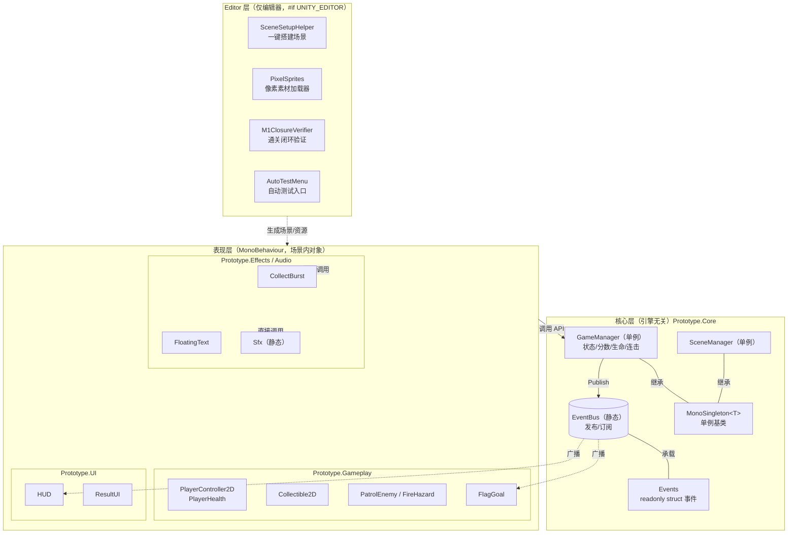
```mermaid
graph TB
    subgraph Editor["Editor 层（仅编辑器，#if UNITY_EDITOR）"]
        SceneSetupHelper["SceneSetupHelper<br/>一键搭建场景"]
        PixelSprites["PixelSprites<br/>像素素材加载器"]
        M1ClosureVerifier["M1ClosureVerifier<br/>通关闭环验证"]
        AutoTestMenu["AutoTestMenu<br/>自动测试入口"]
    end

    subgraph Presentation["表现层（MonoBehaviour，场景内对象）"]
        subgraph Gameplay["Prototype.Gameplay"]
            Player["PlayerController2D<br/>PlayerHealth"]
            Collectible["Collectible2D"]
            Enemy["PatrolEnemy / FireHazard"]
            FlagGoal["FlagGoal"]
        end
        subgraph UI["Prototype.UI"]
            HUD["HUD"]
            ResultUI["ResultUI"]
        end
        subgraph FX["Prototype.Effects / Audio"]
            CollectBurst["CollectBurst"]
            FloatingText["FloatingText"]
            Sfx["Sfx（静态）"]
        end
    end

    subgraph Core["核心层（引擎无关）Prototype.Core"]
        GameManager["GameManager（单例）<br/>状态/分数/生命/连击"]
        SceneManager2["SceneManager（单例）"]
        EventBus[("EventBus（静态）<br/>发布/订阅")]
        Events["Events<br/>readonly struct 事件"]
        MonoSingleton["MonoSingleton&lt;T&gt;<br/>单例基类"]
    end

    Editor -. 生成场景/资源 .-> Presentation
    Presentation -->|调用 API| GameManager
    GameManager -->|Publish| EventBus
    EventBus -. 广播 .-> HUD
    EventBus -. 广播 .-> FlagGoal
    Presentation -->|直接调用| Sfx
    Presentation -->|直接调用| FX
    GameManager ---|继承| MonoSingleton
    SceneManager2 ---|继承| MonoSingleton
    EventBus ---|承载| Events
```

### 4.1.1 架构设计原则

本项目遵循以下架构原则,确保代码可维护、可测试、可扩展:

| 原则 | 实现方式 | 体现位置 |
|---|---|---|
| **关注点分离(SoC)** | 核心层(状态/事件)与表现层(MonoBehaviour 行为)严格分层,不交叉引用 | Core vs Gameplay/UI |
| **依赖倒置(DIP)** | 表现层依赖核心层抽象(EventBus),而非具体订阅者;发布方不认识订阅方 | Collectible2D → EventBus → HUD |
| **事件驱动解耦** | 跨模块通信走静态 EventBus,模块间零直接引用 | ScoreChangedEvent 链路 |
| **单例受控** | 仅全局共享数据(GameManager/SceneManager)用单例;场景内对象不用单例 | MonoSingleton\<T\> |
| **不可变事件** | 事件用 readonly struct,发布后不可篡改,零 GC 分配 | Events.cs |
| **资源零依赖** | 音效/粒子/飘分全部程序化生成,减少外部资产耦合 | Sfx/CollectBurst/FloatingText |
| **引擎无关核心** | Core 层不依赖 UnityEngine.SceneManagement 等具体 API(SceneManager 例外,已用完全限定名隔离) | Core/ 可独立测试 |
| **编辑器隔离** | 编辑器工具 #if UNITY_EDITOR 守卫,不污染运行时构建 | Assets/Editor/ |

### 4.1.2 三层职责边界

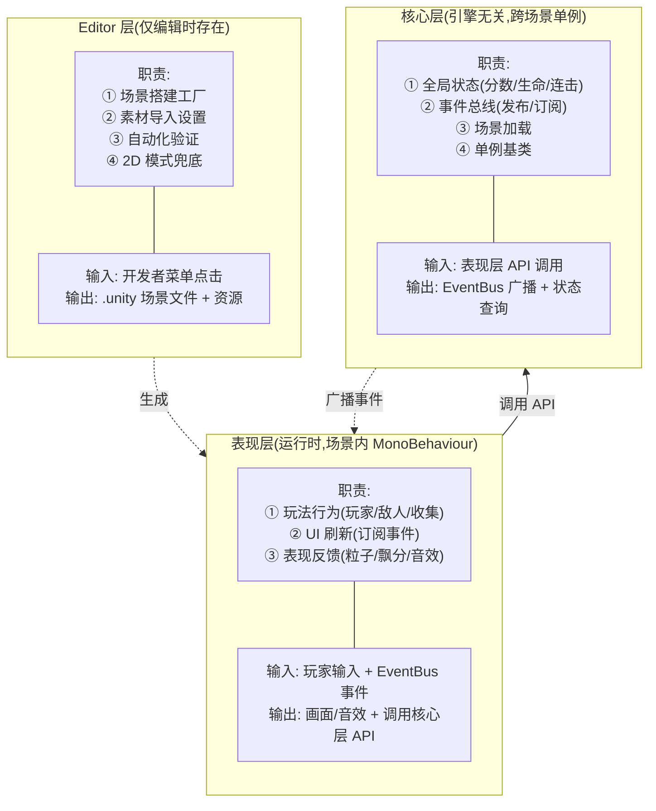
```mermaid
graph TB
    subgraph L1["Editor 层(仅编辑时存在)"]
        direction TB
        L1R["职责:<br/>① 场景搭建工厂<br/>② 素材导入设置<br/>③ 自动化验证<br/>④ 2D 模式兜底"]
        L1I["输入: 开发者菜单点击<br/>输出: .unity 场景文件 + 资源"]
        L1R --- L1I
    end

    subgraph L2["表现层(运行时,场景内 MonoBehaviour)"]
        direction TB
        L2R["职责:<br/>① 玩法行为(玩家/敌人/收集)<br/>② UI 刷新(订阅事件)<br/>③ 表现反馈(粒子/飘分/音效)"]
        L2I["输入: 玩家输入 + EventBus 事件<br/>输出: 画面/音效 + 调用核心层 API"]
        L2R --- L2I
    end

    subgraph L3["核心层(引擎无关,跨场景单例)"]
        direction TB
        L3R["职责:<br/>① 全局状态(分数/生命/连击)<br/>② 事件总线(发布/订阅)<br/>③ 场景加载<br/>④ 单例基类"]
        L3I["输入: 表现层 API 调用<br/>输出: EventBus 广播 + 状态查询"]
        L3R --- L3I
    end

    L1 -. 生成 .-> L2
    L2 -->|调用 API| L3
    L3 -. 广播事件 .-> L2
```

### 4.1.3 分层调用规则

| 调用方向 | 允许? | 示例 | 说明 |
|---|---|---|---|
| Editor → 表现层 | ✅ 允许 | `SceneSetupHelper` 组装 Player/Collectible | 编辑器负责生成场景对象 |
| Editor → 核心层 | ✅ 允许 | `M1ClosureVerifier` 调 `GameManager.AddScore` | 验证器驱动核心状态 |
| 表现层 → 核心层 | ✅ 允许 | `Collectible2D` 调 `GameManager.RegisterCollect` | 表现层读写全局状态 |
| 表现层 → 表现层(同层) | ⚠️ 受限 | `PatrolEnemy` 调 `PlayerHealth.Damage` | 同层直接引用可接受,但跨子模块建议走事件 |
| 核心层 → 表现层 | ❌ 禁止 | — | 核心层不认识具体 MonoBehaviour |
| 核心层 → 核心层 | ✅ 允许 | `GameManager` 调 `EventBus.Publish` | 核心层内部协作 |
| 表现层 → Editor | ❌ 禁止 | — | 运行时不能调编辑器 API |

### 4.1.4 命名空间与程序集划分

本项目全部代码位于顶层命名空间 `Prototype` 下,按职责拆分为 6 个子命名空间:

| 命名空间 | 层级 | 文件数 | 职责 | 引擎依赖 |
|---|---|---|---|---|
| `Prototype.Core` | 核心层 | 5 | 单例基类、事件总线、事件定义、全局状态、场景管理 | `UnityEngine`(**最小化**) |
| `Prototype.Gameplay` | 表现层 | 13 | 玩家控制、生命、收集物、敌人、陷阱、平台、相机、过关、测试工具 | `UnityEngine` + `Core` + `Effects` + `Audio` |
| `Prototype.UI` | 表现层 | 2 | HUD、结算界面 | `UnityEngine.UI` + `Core` |
| `Prototype.Effects` | 表现层 | 2 | 粒子爆发、飘分文字 | `UnityEngine` |
| `Prototype.Audio` | 表现层 | 1 | 程序化音效合成 | `UnityEngine` |
| `Prototype.Editor` | Editor 层 | 6 | 场景搭建、素材加载、测试菜单、2D 设置 | `UnityEditor`(`#if UNITY_EDITOR`) |
| `Prototype.Verification` | Editor 层 | 1 | M1 通关闭环验证 | `UnityEditor` |

> **注**:本工程未使用 Unity Assembly Definition(`.asmdef`)显式划分程序集,所有脚本编译为单一 `Assembly-CSharp.dll`。命名空间仅作逻辑隔离。如需缩短编译时间,可后续添加 `.asmdef` 文件强制依赖方向。

### 4.1.5 单例与静态工具一览

本项目使用两类"全局入口",职责不同:

| 入口 | 类型 | 生命周期 | 适用场景 | 示例 |
|---|---|---|---|---|
| `GameManager.Instance` | `MonoSingleton<T>` | `DontDestroyOnLoad`,跨场景保留 | 需要存储跨场景状态、需要 Unity 生命周期的管理器 | 分数/生命/连击 |
| `SceneManager.Instance` | `MonoSingleton<T>` | `DontDestroyOnLoad`,跨场景保留 | 需要调用引擎 API 的全局管理器 | 场景加载 |
| `EventBus` | 静态类 | 进程级,不随场景销毁 | 跨模块通信,**订阅者必须手动退订** | 发布/订阅事件 |
| `Sfx` | 静态类 | 进程级 | 无状态工具,需外部注入 `AudioSource` | 播放音效 |
| `SpriteAnimUtil` | 静态类 | 进程级 | 纯函数工具,无状态 | 2 帧动画翻转 |
| `AutoTestUtil` | 静态类 | 进程级 | 纯函数工具,无状态 | 测试辅助 |

> **约定**:场景内 MonoBehaviour(如 `PlayerController2D`/`Collectible2D`)**不使用单例**,通过 `GetComponent`/`FindObjectOfType` 获取引用,保证可测试性。

### 4.2 核心数据流（收集 → 通关）
> **口径勘误（2026-09-30 按 Main.unity 实测更新）**
> 现行规则：**通关 = 触旗（FlagGoal）**，`WinCondition` 已于 2026-09-30 删除；**星级 = 收集率**（Collected / TotalCollectibles，60%/80%/100% → 1/2/3 星）；
> 收集物共 18 个（15 心 ×5 分 + 3 宝石 ×15 分，无连击满分 120）；`HUD.targetScore = 60` 只是进度条参照分与提示切换点，**不是通关线**。
> 旧版「分数 ≥ targetScore → 切 Result」的 M1 路径已随 `WinCondition.cs` 一起移除，下面各图统一按触旗通关描述。


```
Collectible2D.OnTriggerEnter2D (玩家触发)
  → GameManager.Instance.RegisterCollect(scoreValue)   // 登记收集、计算连击、加分
      → AddScore(delta × combo)
      → EventBus.Publish(ScoreChangedEvent)            // 广播分数
      → EventBus.Publish(ComboChangedEvent)            // 广播连击
  → FloatingText.Spawn / CollectBurst.Spawn / Sfx.Collect  // 表现反馈
  → Destroy(gameObject)

EventBus 发布 ScoreChangedEvent 后：
  → HUD.OnScoreChanged()         // 订阅：刷新分数文本 + 进度条
  → FlagGoal.OnTriggerEnter2D()   // 触旗 → SceneManager.Load("Result")
  → ResultUI.Start()             // 结算页读取 GameManager.Score / Collected
```

**关键设计**：玩法表现层之间**零直接引用**，全部通过静态 `EventBus` 解耦。`Collectible2D` 不认识 `HUD`，只通知 `GameManager` 与触发表现。

#### 4.2.1 收集 → 通关 时序图

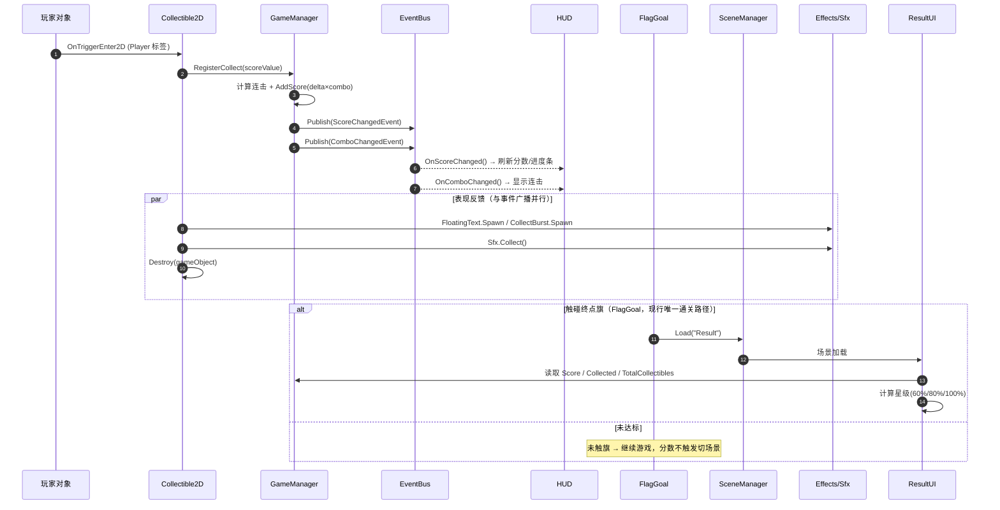
```mermaid
sequenceDiagram
    autonumber
    participant Player as 玩家对象
    participant Coll as Collectible2D
    participant GM as GameManager
    participant Bus as EventBus
    participant HUD as HUD
    participant FG as FlagGoal
    participant SM as SceneManager
    participant FX as Effects/Sfx
    participant RUI as ResultUI

    Player->>Coll: OnTriggerEnter2D (Player 标签)
    Coll->>GM: RegisterCollect(scoreValue)
    GM->>GM: 计算连击 + AddScore(delta×combo)
    GM->>Bus: Publish(ScoreChangedEvent)
    GM->>Bus: Publish(ComboChangedEvent)
    Bus-->>HUD: OnScoreChanged() → 刷新分数/进度条
    Bus-->>HUD: OnComboChanged() → 显示连击

    par 表现反馈（与事件广播并行）
        Coll->>FX: FloatingText.Spawn / CollectBurst.Spawn
        Coll->>FX: Sfx.Collect()
        Coll->>Coll: Destroy(gameObject)
    end

    alt 触碰终点旗（FlagGoal，现行唯一通关路径）
        FG->>SM: Load("Result")
        SM->>RUI: 场景加载
        RUI->>GM: 读取 Score / Collected / TotalCollectibles
        RUI->>RUI: 计算星级(60%/80%/100%)
    else 未达标
        Note over FG: 未触旗 → 继续游戏，分数不触发切场景
    end
```

#### 4.2.2 玩家受伤 → 死亡 时序图

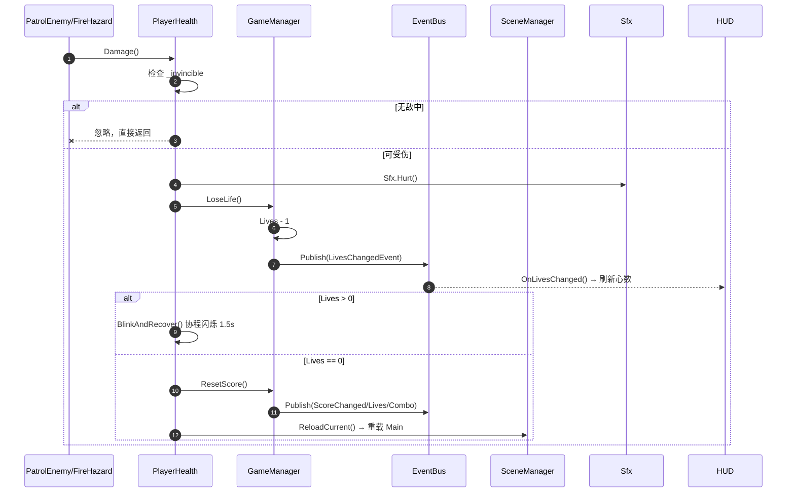
```mermaid
sequenceDiagram
    autonumber
    participant Haz as PatrolEnemy/FireHazard
    participant PH as PlayerHealth
    participant GM as GameManager
    participant Bus as EventBus
    participant SM as SceneManager
    participant Sfx as Sfx

    Haz->>PH: Damage()
    PH->>PH: 检查 _invincible

    alt 无敌中
        PH--xHaz: 忽略，直接返回
    else 可受伤
        PH->>Sfx: Sfx.Hurt()
        PH->>GM: LoseLife()
        GM->>GM: Lives - 1
        GM->>Bus: Publish(LivesChangedEvent)
        Bus-->>HUD: OnLivesChanged() → 刷新心数

        alt Lives > 0
            PH->>PH: BlinkAndRecover() 协程闪烁 1.5s
        else Lives == 0
            PH->>GM: ResetScore()
            GM->>Bus: Publish(ScoreChanged/Lives/Combo)
            PH->>SM: ReloadCurrent() → 重载 Main
        end
    end
```

#### 4.2.3 关卡生命周期状态图

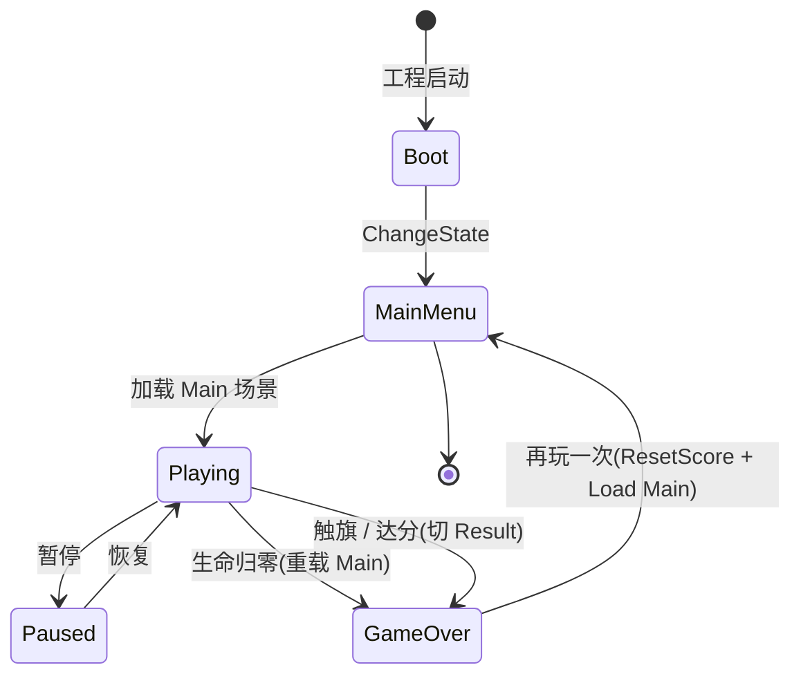
```mermaid
stateDiagram-v2
    [*] --> Boot: 工程启动
    Boot --> MainMenu: ChangeState
    MainMenu --> Playing: 加载 Main 场景
    Playing --> Paused: 暂停
    Paused --> Playing: 恢复
    Playing --> GameOver: 生命归零(重载 Main)
    Playing --> GameOver: 触旗 / 达分(切 Result)
    GameOver --> MainMenu: 再玩一次(ResetScore + Load Main)
    MainMenu --> [*]
```

#### 4.2.4 事件订阅生命周期

```mermaid
sequenceDiagram
    autonumber
    participant Bus as EventBus
    participant Sub as HUD

    Note over Sub: 场景加载，对象激活
    Sub->>Bus: OnEnable() → Subscribe&lt;ScoreChangedEvent&gt;
    Note over Bus: Handlers 字典登记委托

    Note over Sub: 运行期间多次
    Bus->>Sub: Publish 触发 OnScoreChanged()

    Note over Sub: 场景卸载/对象禁用
    Sub->>Bus: OnDisable() → Unsubscribe&lt;ScoreChangedEvent&gt;
    Note over Bus: 移除委托，避免引用已销毁对象
```

---

## 5. 核心框架层 Prototype.Core

位于 `Assets/Scripts/Core/`。引擎无关，从脚手架原样保留。

### 5.0 模块职责概览

`Prototype.Core` 是整个项目的**基础设施层**,为上层提供四大能力。本层**不依赖任何上层模块**,可独立编译测试。

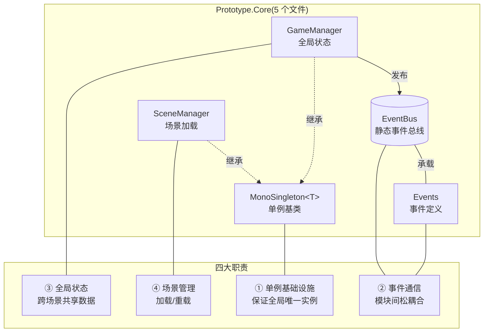
```mermaid
graph TD
    subgraph Core["Prototype.Core(5 个文件)"]
        MS["MonoSingleton&lt;T&gt;<br/>单例基类"]
        EB[("EventBus<br/>静态事件总线")]
        EV["Events<br/>事件定义"]
        GM["GameManager<br/>全局状态"]
        SM["SceneManager<br/>场景加载"]
    end

    subgraph Resp["四大职责"]
        R1["① 单例基础设施<br/>保证全局唯一实例"]
        R2["② 事件通信<br/>模块间松耦合"]
        R3["③ 全局状态<br/>跨场景共享数据"]
        R4["④ 场景管理<br/>加载/重载"]
    end

    MS --- R1
    EB --- R2
    EV --- R2
    GM --- R3
    SM --- R4

    GM -.继承.-> MS
    SM -.继承.-> MS
    GM -->|发布| EB
    EB ---|承载| EV
```

| 文件 | 类 | 职责 | 依赖 |
|---|---|---|---|
| `MonoSingleton.cs` | `MonoSingleton<T>` | 泛型单例基类,保证全局唯一 + 跨场景保留 | `UnityEngine`(Object/GameObject/DontDestroyOnLoad) |
| `EventBus.cs` | `EventBus`(静态) | 类型安全的发布/订阅事件总线 | `System`(Delegate/Dictionary) |
| `Events.cs` | `GameState` + 5 个 `readonly struct` | 事件数据定义 | 无(纯 C#) |
| `GameManager.cs` | `GameManager : MonoSingleton<GameManager>` | 全局状态机 + 分数/生命/连击管理 | `UnityEngine` + `EventBus` + `Events` |
| `SceneManager.cs` | `SceneManager : MonoSingleton<SceneManager>` | 场景加载/重载(包装引擎 API) | `UnityEngine.SceneManagement`(完全限定名) |

**本层设计特点**:
- **引擎依赖最小化**:`Events.cs` 完全纯 C#;`EventBus.cs` 仅用 `System` 委托;`MonoSingleton.cs` 只用 `UnityEngine.Object`。
- **线程模型**:仅在主线程调用(Unity 生命周期约束),EventBus 非线程安全。
- **扩展方式**:新增事件类型只需在 `Events.cs` 加 `readonly struct`,订阅方/发布方各自实现,无需改动 EventBus。

### 5.1 MonoSingleton\<T> — 泛型单例基类

`MonoSingleton.cs`。泛型约束 `where T : MonoSingleton<T>`，保证全局唯一实例。

| 成员 | 说明 |
|---|---|
| `static T Instance` | 首次访问时 `FindFirstObjectByType<T>()`，找不到则自动 `new GameObject` + `AddComponent` |
| `protected virtual void Awake()` | 重复实例 `Destroy`；根节点自动 `DontDestroyOnLoad`（跨场景保留） |
| `protected virtual void OnAwake()` | 子类初始化入口（替代 Awake，避免覆盖单例逻辑） |
| `protected virtual void OnDestroy()` | 实例销毁时清空静态引用 |

### 5.2 EventBus — 静态类型安全事件总线

`EventBus.cs`。`Dictionary<Type, Delegate>` 实现的轻量发布/订阅。

| 方法 | 说明 |
|---|---|
| `static void Subscribe<T>(Action<T>)` | 按事件类型订阅（委托合并） |
| `static void Unsubscribe<T>(Action<T>)` | 退订（合并后为 null 则移除键） |
| `static void Publish<T>(T)` | 触发某类型所有订阅者 |
| `static void Clear()` | 清空全部订阅（测试/重置用） |

> **注意**：静态总线不随场景卸载自动清理。订阅者须在 `OnDisable`/`OnDestroy` 配对 `Unsubscribe`，否则引用已销毁对象导致泄漏。推荐 `OnEnable/OnDisable` 配对（见 `HUD`）。

### 5.3 Events — 事件定义

`Events.cs`。全部用 `readonly struct`（不可变、零 GC 分配）。

| 类型 | 字段 | 触发方 |
|---|---|---|
| `enum GameState` | `Boot/MainMenu/Playing/Paused/GameOver` | — |
| `GameStateChangedEvent` | `Previous`, `Current` | `GameManager.ChangeState` |
| `ScoreChangedEvent` | `Total`, `Delta` | `GameManager.AddScore` |
| `LivesChangedEvent` | `Lives` | `GameManager.LoseLife` / `PlayerHealth.Start` |
| `SceneLoadedEvent` | `SceneName` | `SceneManager.Load*` |
| `ComboChangedEvent` | `Combo` | `GameManager.RegisterCollect` / `Update` 连击超时 |

### 5.4 GameManager — 全局游戏状态管理（单例）

`GameManager.cs`。继承 `MonoSingleton<GameManager>`。持有跨场景共享数据，变化通过 `EventBus` 广播。

| 成员 | 说明 |
|---|---|
| `const int MaxLives = 3` | 最大生命 |
| `const float ComboWindow = 4f` | 连击窗口（秒） |
| `const int ComboCap = 5` | 连击倍率上限 |
| `GameState CurrentState` | 当前状态（初始 `Boot`） |
| `int Score / Lives / Collected / TotalCollectibles` | 分数/生命/已收集/总数 |
| `bool Won` | 是否已通关 |
| `int ComboCount` | 当前连击倍率（初始 1） |
| `ChangeState(GameState)` | 切换状态并广播 `GameStateChangedEvent`（相同状态不触发） |
| `AddScore(int)` | 加分并广播 `ScoreChangedEvent` |
| `RegisterCollect(int delta)` | 登记收集：连击窗口内连击 +1（封顶 5），按 `分值×连击` 计分；返回连击倍率 |
| `LoseLife()` | 扣 1 生命并广播 `LivesChangedEvent`；返回是否存活 |
| `ResetScore()` | 清零分数/生命/收集/连击并广播三个事件 |
| `MarkWon()` | 标记通关 |
| `Update()` | 连击超时自动归 1 并广播 `ComboChangedEvent` |

### 5.5 SceneManager — 场景加载（单例）

`SceneManager.cs`。

> 类名与 `UnityEngine.SceneManagement.SceneManager` 同名，内部统一用**完全限定名**调用引擎 API，避免递归。

| 方法 | 说明 |
|---|---|
| `Load(string, LoadSceneMode)` | 同步加载场景并广播 `SceneLoadedEvent` |
| `Load(int, LoadSceneMode)` | 按索引同步加载 |
| `LoadAsync(string)` | 异步加载，返回 `AsyncOperation`，并广播事件 |
| `ReloadCurrent()` | 重载当前活动场景并广播 |

---

## 6. 玩法系统层 Prototype.Gameplay

位于 `Assets/Scripts/Gameplay/`。

### 6.0 模块职责概览

`Prototype.Gameplay` 是**最大的子模块**(13 个文件),承载全部 2D 玩法行为。可细分为 6 个职责子组:

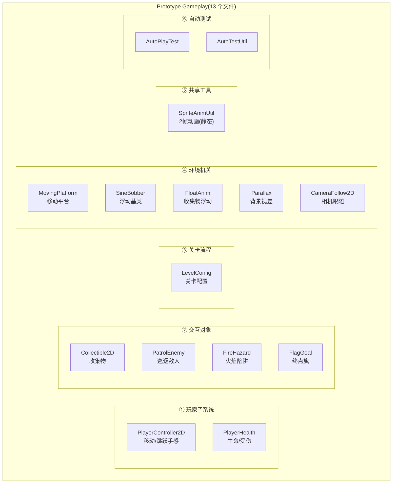
```mermaid
graph TD
    subgraph Gameplay["Prototype.Gameplay(13 个文件)"]
        subgraph Player["① 玩家子系统"]
            PC["PlayerController2D<br/>移动/跳跃手感"]
            PH["PlayerHealth<br/>生命/受伤"]
        end
        subgraph Interact["② 交互对象"]
            Coll["Collectible2D<br/>收集物"]
            PE["PatrolEnemy<br/>巡逻敌人"]
            FH["FireHazard<br/>火焰陷阱"]
            FG["FlagGoal<br/>终点旗"]
        end
        subgraph Flow["③ 关卡流程"]
            LC["LevelConfig<br/>关卡配置"]
        end
        subgraph Env["④ 环境机关"]
            MP["MovingPlatform<br/>移动平台"]
            SB["SineBobber<br/>浮动基类"]
            FA["FloatAnim<br/>收集物浮动"]
            Px["Parallax<br/>背景视差"]
            CF["CameraFollow2D<br/>相机跟随"]
        end
        subgraph Util["⑤ 共享工具"]
            SA["SpriteAnimUtil<br/>2帧动画(静态)"]
        end
        subgraph Test["⑥ 自动测试"]
            APT["AutoPlayTest"]
            ATU["AutoTestUtil"]
        end
    end
```

| 子组 | 文件 | 职责 | 依赖层 |
|---|---|---|---|
| ① 玩家子系统 | `PlayerController2D`, `PlayerHealth` | 玩家输入、物理移动、跳跃手感、生命与受伤反馈 | Core + Audio |
| ② 交互对象 | `Collectible2D`, `PatrolEnemy`, `FireHazard`, `FlagGoal` | 玩家可触碰的玩法对象:收集/战斗/陷阱/终点 | Core + Effects + Audio |
| ③ 关卡流程 | `FlagGoal`, `LevelConfig` | 过关判定与关卡数据注入 | Core |
| ④ 环境机关 | `MovingPlatform`, `SineBobber`, `FloatAnim`, `Parallax`, `CameraFollow2D` | 平台运动、浮动、视差、相机跟随 | Core(仅 CameraFollow 不依赖) |
| ⑤ 共享工具 | `SpriteAnimUtil` | 2 帧精灵动画工具(供 FireHazard/PatrolEnemy 复用) | 无 |
| ⑥ 自动测试 | `AutoPlayTest`, `AutoTestUtil` | 自动通关验证(开发期使用,不参与正式玩法) | AutoTestUtil |

**模块设计特点**:
- **触发驱动**:交互对象用 `OnTriggerEnter2D`/`OnCollisionEnter2D`,非轮询。
- **标签判定**:玩家对象统一用 `"Player"` 标签,交互对象不需引用玩家类型。
- **法线判定制敌**:`PatrolEnemy` 用碰撞法线 `y > 0.5` 区分踩头/侧碰,无需复杂物理。
- **复用基类**:`MovingPlatform`/`FloatAnim` 继承 `SineBobber`,消除正弦浮动重复代码。
- **静态工具**:`SpriteAnimUtil`/`AutoTestUtil` 为纯函数静态类,无状态。

### 6.1 PlayerController2D — 玩家控制（核心）

`PlayerController2D.cs`。`[RequireComponent(typeof(Rigidbody2D))]`。2D 像素角色平台跳跃手感。

**输入**：A/D 或方向键移动，空格跳跃，按下方向键/S 快速下落。

| 特性 | 实现 |
|---|---|
| 地面加速 / 空中弱控制 | `groundAccel` 地面、`groundAccel × airControl` 空中，`MoveTowards` 线性插值 |
| 土狼时间（coyote time） | 离开平台 `coyoteTime` 秒内仍可跳 |
| 跳跃缓冲（jump buffer） | 落地前 `jumpBufferTime` 秒内按键被记住，落地即起跳 |
| 跳砍（jump cut） | 提前松 `Jump` 键，上升速度乘 `jumpCutMultiplier` |
| 非对称重力 | 上升 `riseGravityScale`（轻）、下降 `fallGravityScale`（重）、快速下落 `fastFallGravity` |
| 下落速度上限 | `maxFallSpeed`，快速下落 `fastFallMaxSpeed` |
| 朝向翻转 | 移动时翻转 `localScale.x` |
| 精灵切换 | 地面/空中用不同 sprite |

关键方法：`Update()`（跳跃缓冲/土狼时间/跳砍/精灵切换）、`FixedUpdate()`（水平移动/重力）、`ApplyGravity()`（非对称重力）、`IsGrounded()`（向下射线）。

#### 6.1.1 跳跃手感时序图（土狼时间 + 跳跃缓冲 + 跳砍）

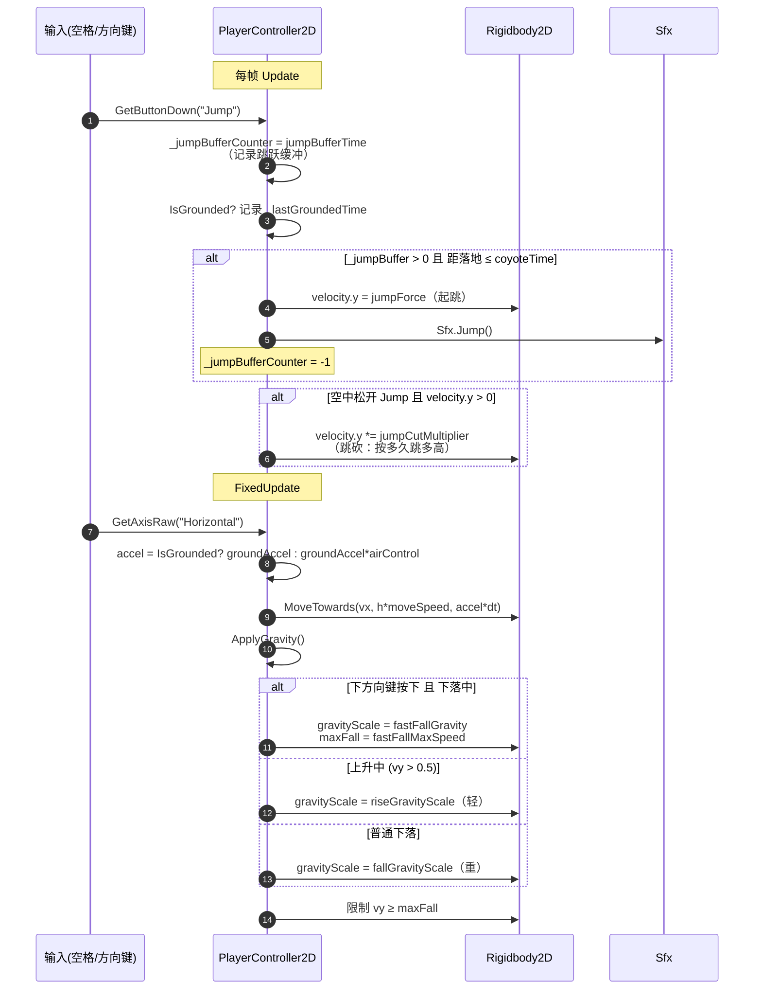
```mermaid
sequenceDiagram
    autonumber
    participant Input as 输入(空格/方向键)
    participant PC as PlayerController2D
    participant RB as Rigidbody2D
    participant Sfx as Sfx

    Note over PC: 每帧 Update
    Input->>PC: GetButtonDown("Jump")
    PC->>PC: _jumpBufferCounter = jumpBufferTime<br/>（记录跳跃缓冲）

    PC->>PC: IsGrounded? 记录 _lastGroundedTime

    alt _jumpBuffer > 0 且 距落地 ≤ coyoteTime
        PC->>RB: velocity.y = jumpForce（起跳）
        PC->>Sfx: Sfx.Jump()
        Note over PC: _jumpBufferCounter = -1
    end

    alt 空中松开 Jump 且 velocity.y > 0
        PC->>RB: velocity.y *= jumpCutMultiplier<br/>（跳砍：按多久跳多高）
    end

    Note over PC: FixedUpdate
    Input->>PC: GetAxisRaw("Horizontal")
    PC->>PC: accel = IsGrounded? groundAccel : groundAccel*airControl
    PC->>RB: MoveTowards(vx, h*moveSpeed, accel*dt)
    PC->>PC: ApplyGravity()

    alt 下方向键按下 且 下落中
        PC->>RB: gravityScale = fastFallGravity<br/>maxFall = fastFallMaxSpeed
    else 上升中 (vy > 0.5)
        PC->>RB: gravityScale = riseGravityScale（轻）
    else 普通下落
        PC->>RB: gravityScale = fallGravityScale（重）
    end
    PC->>RB: 限制 vy ≥ maxFall
```

#### 6.1.2 连击系统状态图

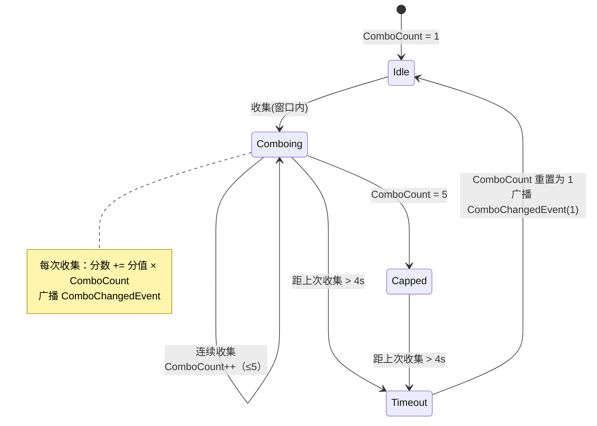
```mermaid
stateDiagram-v2
    [*] --> Idle: ComboCount = 1
    Idle --> Comboing: 收集(窗口内)
    Comboing --> Comboing: 连续收集<br/>ComboCount++（≤5）
    Comboing --> Timeout: 距上次收集 > 4s
    Comboing --> Capped: ComboCount = 5
    Capped --> Timeout: 距上次收集 > 4s
    Timeout --> Idle: ComboCount 重置为 1<br/>广播 ComboChangedEvent(1)

    note right of Comboing
        每次收集：分数 += 分值 × ComboCount
        广播 ComboChangedEvent
    end note
```

### 6.2 PlayerHealth — 生命与受伤

`PlayerHealth.cs`。

| 成员 | 说明 |
|---|---|
| `Damage()` | 受伤入口：无敌期内忽略；调 `GameManager.LoseLife()`，存活则闪烁恢复，归零则 `Die()` |
| `Die()` | `ResetScore()` + `SceneManager.ReloadCurrent()` |
| `BlinkAndRecover()` | 协程：`invincibleTime` 内按 `blinkInterval` 闪烁，结束后解除无敌 |
| `Start()` | 广播 `LivesChangedEvent` 初始化 HUD 心数 |

### 6.3 Collectible2D — 可收集物

`Collectible2D.cs`。`OnTriggerEnter2D`：玩家（`"Player"` 标签）进入 → `RegisterCollect(scoreValue)` → 飘分文字 + 粒子 + 音效 → `Destroy`。连击 ≥3 时文字/粒子变金色。分值场景配置（红心 5 / 蓝宝石 15）。需 `Collider2D` 设为 `Is Trigger`。

### 6.4 PatrolEnemy — 巡逻敌人

`PatrolEnemy.cs`。`[RequireComponent(typeof(Rigidbody2D))]`。在 `[minX, maxX]` 来回移动，2 帧精灵动画。

`OnCollisionEnter2D`：法线 `y > 0.5`（玩家踩头）→ `AddScore(killScore)` + 飘分 + 粒子 + `Sfx.Stomp` + 销毁；否则 → `PlayerHealth.Damage()`。

### 6.5 FireHazard — 火焰陷阱

`FireHazard.cs`。`[RequireComponent(typeof(Collider2D))]`。静态危险物，2 帧动画。`OnTriggerEnter2D` 与 `OnCollisionEnter2D` 都调用 `PlayerHealth.Damage()`（无敌期内不重复扣血由 `PlayerHealth` 处理）。

### 6.6 FlagGoal — 终点旗帜

`FlagGoal.cs`。玩家触碰 → `MarkWon()` + `Sfx.Win()` + 延迟 `settleDelay` 秒后 `SceneManager.Load("Result")`。触旗即通关，分数/收集率决定结算星级。

### 6.7 WinCondition — 过关条件（已移除）

M1 遗留路径：`OnEnable` 订阅 `ScoreChangedEvent`，分数达 `targetScore` 后切 `nextSceneName`。它与 §6.6 `FlagGoal` 的触旗通关互斥，且从未挂载在 Main 场景（组件清单实测 FlagGoal×1、WinCondition×0）。组件与脚本 已于 2026-09-30 删除，过关判定统一见 §6.6。


### 6.8 LevelConfig — 关卡配置

`LevelConfig.cs`。`Start()` 时把本关 `totalCollectibles` 注入 `GameManager.TotalCollectibles`（结算页统计收集率用，`Mathf.Max(1, …)` 防除零）。

### 6.9 平台与视差

| 类 | 文件 | 说明 |
|---|---|---|
| `MovingPlatform` | `MovingPlatform.cs` | 继承 `SineBobber`，上下浮动平台；玩家在上方时 `SetParent` 跟随，离开恢复 |
| `SineBobber` | `SineBobber.cs` | 正弦浮动抽象基类，子类暴露 `Amplitude`/`Speed`；`ApplyBob()` 按 `Sin(time×Speed+phase)` 偏移 |
| `FloatAnim` | `FloatAnim.cs` | 继承 `SineBobber`，让收集物轻微浮动，相位随机 |
| `Parallax` | `Parallax.cs` | 背景水平视差，`factor=1` 远景固定、`factor=0` 贴屏跟随 |
| `CameraFollow2D` | `CameraFollow2D.cs` | 正交相机 `LateUpdate` 平滑跟随，`lockY` 固定 Y（横向关卡更稳） |
| `SpriteAnimUtil` | `SpriteAnimUtil.cs` | 静态工具，`TickTwoFrame` 按间隔在两帧精灵间翻转（供 `FireHazard`/`PatrolEnemy` 复用） |

### 6.10 自动测试工具（Gameplay 内）

自动测试脚本现存 2 个，公共逻辑集中在 `AutoTestUtil`；旧版 `AutoTestManager` / `AutoTestRunner` 已于 2026-09-30 一并删除。

| 类 | 文件 | 说明 |
|---|---|---|
| `AutoPlayTest` | `AutoPlayTest.cs` | 按 **T 键** 开始，自动收集场景内所有收集物（`FindGameObjectsWithTag("Collectible")` 或按名字前缀） |
| `AutoTestUtil` | `AutoTestUtil.cs` | 静态公共逻辑：`GatherByNamePrefix` / `SortByX` / `Grounded` |

> 完整闭环验证推荐用编辑器菜单 `Prototype/验证/M1 通关闭环`（`M1ClosureVerifier.cs`），而非会劫持控制的旧测试。

---

## 7. UI 系统层 Prototype.UI

位于 `Assets/Scripts/UI/`。基于 uGUI（`UnityEngine.UI.Text/Image/Button`）。

### 7.0 模块职责概览

`Prototype.UI` 仅 2 个文件,负责**显示与交互入口**,不持有游戏状态。

| 文件 | 类 | 职责 | 状态来源 | 更新方式 |
|---|---|---|---|---|
| `HUD.cs` | `HUD : MonoBehaviour` | 游戏内信息:分数/进度/生命/连击/提示 | `GameManager`(读取) | 订阅 `EventBus` 三个事件 |
| `ResultUI.cs` | `ResultUI : MonoBehaviour` | 结算页:最终分数/收集统计/星级/再玩按钮 | `GameManager`(读取) | `Start()` 一次性读取 |

**模块设计特点**:
- **只读状态**:UI 不修改游戏状态,仅从 `GameManager` 读 + 订阅事件刷新显示。
- **事件订阅生命周期**:`HUD` 在 `OnEnable` 订阅、`OnDisable` 退订,避免静态总线泄漏。
- **无直接引用玩法对象**:`HUD` 不认识 `PlayerController2D`/`Collectible2D`,只通过事件获知变化。
- **场景边界**:`HUD` 属 `Main` 场景,`ResultUI` 属 `Result` 场景,随场景加载/卸载。

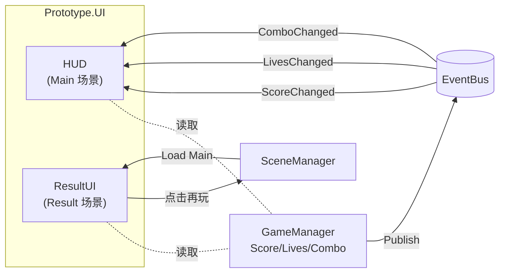
```mermaid
graph LR
    subgraph UI["Prototype.UI"]
        HUD["HUD<br/>(Main 场景)"]
        RUI["ResultUI<br/>(Result 场景)"]
    end

    GM["GameManager<br/>Score/Lives/Combo"]
    Bus[("EventBus")]
    SM["SceneManager"]

    GM -->|Publish| Bus
    Bus -->|ScoreChanged| HUD
    Bus -->|LivesChanged| HUD
    Bus -->|ComboChanged| HUD
    HUD -.读取.- GM
    RUI -.读取.- GM
    RUI -->|点击再玩| SM
    SM -->|Load Main| RUI
```

### 7.1 HUD — 游戏内信息

`HUD.cs`。

| 成员 | 说明 |
|---|---|
| `Text scoreText/hintText/comboText` | 分数 / 提示 / 连击 |
| `Image progressFill` | 分数进度条（按 `targetScore` 比例缩放宽度） |
| `Image[] hearts` | 生命心形（`fullHeart`/`emptyHeart` 精灵或着色） |
| `OnEnable()` | 订阅 `ScoreChanged/LivesChanged/ComboChanged` 三个事件 |
| `OnDisable()` | 退订（防止泄漏） |
| `OnScoreChanged` | 刷新分数文本、达 HUD 参照分（60）后改提示语、更新进度条（不触发通关） |
| `OnLivesChanged` | 刷新心数 |
| `OnComboChanged` | 连击 ≥2 显示 `连击 xN！`，否则隐藏 |

### 7.2 ResultUI — 结算界面

`ResultUI.cs`。`Start()` 读取 `GameManager` 显示最终分数、收集统计与星级（收集率 60%/80%/100% → 1/2/3 星）。`ReplayButton` 点击 → `ResetScore()` + `SceneManager.Load("Main")`。

---

## 8. 特效与音频层 Prototype.Effects / Prototype.Audio

### 8.0 模块职责概览

本层 3 个文件,提供**即时表现反馈**:粒子、飘分文字、音效。全部**资源零依赖**,运行时程序化生成,无外部素材文件。

| 文件 | 命名空间 | 类型 | 职责 | 资源依赖 |
|---|---|---|---|---|
| `CollectBurst.cs` | `Prototype.Effects` | `MonoBehaviour` | 收集时彩色方块粒子爆发 | `Texture2D.whiteTexture`(Unity 内置) |
| `FloatingText.cs` | `Prototype.Effects` | `MonoBehaviour`(静态工厂) | 飘分文字上浮淡出 | `LegacyRuntime.ttf`(Unity 内置) |
| `Sfx.cs` | `Prototype.Audio` | 静态类 | 正弦波合成短音效 | 无(运行时 `AudioClip.Create`) |

**模块设计特点**:
- **静态工厂模式**:`FloatingText.Spawn`/`CollectBurst.Spawn`/`Sfx.Jump` 均为静态方法,调用方无需持有引用。
- **自销毁对象**:`CollectBurst`/`FloatingText` 实例在动画结束后 `Destroy(gameObject)`,无对象池(原型阶段简化)。
- **无状态**:`Sfx` 不持有任何字段(仅缓存 `AudioClip`),需外部通过 `SetSource(AudioSource)` 注入播放器。
- **2D 适配**:`FloatingText` 用 `TextMesh`(世界空间)而非 uGUI `Text`,适配 2D 正交相机,无需 Canvas。
- **渲染层级**:`CollectBurst` 设 `sortingOrder=30` 保证显示在收集物之上。

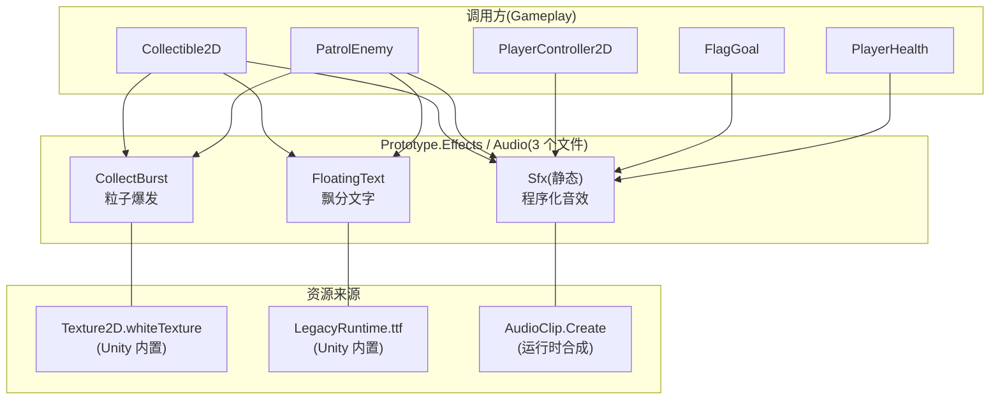
```mermaid
graph TD
    subgraph FX["Prototype.Effects / Audio(3 个文件)"]
        CB["CollectBurst<br/>粒子爆发"]
        FT["FloatingText<br/>飘分文字"]
        Sfx["Sfx(静态)<br/>程序化音效"]
    end

    subgraph Res["资源来源"]
        W["Texture2D.whiteTexture<br/>(Unity 内置)"]
        F["LegacyRuntime.ttf<br/>(Unity 内置)"]
        AC["AudioClip.Create<br/>(运行时合成)"]
    end

    subgraph Callers["调用方(Gameplay)"]
        Coll["Collectible2D"]
        PE["PatrolEnemy"]
        PC["PlayerController2D"]
        FG["FlagGoal"]
        PH["PlayerHealth"]
    end

    CB --- W
    FT --- F
    Sfx --- AC

    Coll --> CB
    Coll --> FT
    Coll --> Sfx
    PE --> CB
    PE --> FT
    PE --> Sfx
    PC --> Sfx
    FG --> Sfx
    PH --> Sfx
```

### 8.1 CollectBurst — 收集粒子爆发

`CollectBurst.cs`。`Spawn(pos, color, count=8)`：生成若干彩色小方块，随机速度飞出、受重力下坠、`_life` 倒计时淡出销毁。用 `Texture2D.whiteTexture` 缓存为静态 `Sprite`，无外部资源依赖。`sortingOrder=30` 保证显示在前。

### 8.2 FloatingText — 飘分文字

`FloatingText.cs`。`Spawn(pos, text, color)`：用 `TextMesh`（世界空间，避免 Canvas 依赖，适配 2D 正交相机）生成，缓慢上飘 + 淡出 + 自毁。字体用内置 `LegacyRuntime.ttf`。

### 8.3 Sfx — 程序化音效（静态）

`Sfx.cs`。运行时用正弦波合成短音效，**不依赖外部音频文件**。场景搭建时把玩家 `AudioSource` 注入（`Sfx.SetSource`），之后各处调静态方法。

| 方法 | 频率走向 | 时长 | 用途 |
|---|---|---|---|
| `Jump()` | 520 → 780 Hz | 0.12s | 跳跃 |
| `Collect()` | 880 → 1320 Hz | 0.13s | 收集 |
| `Hurt()` | 240 → 110 Hz | 0.28s | 受伤 |
| `Stomp()` | 320 → 140 Hz | 0.18s | 踩敌 |
| `Win()` | 660 → 1040 Hz | 0.55s | 通关 |

`MakeTone(f0, f1, dur, vol)`：线性频率插值 + 起音快速/指数衰减包络，`AudioClip.Create` 生成单声道 22050 采样。首次生成后缓存复用。

---

## 9. 编辑器工具层 Prototype.Editor / Prototype.Verification

位于 `Assets/Editor/`。全部 `#if UNITY_EDITOR` 守卫。

### 9.0 模块职责概览

`Prototype.Editor` + `Prototype.Verification` 共 7 个文件,**仅在 Unity 编辑器内运行**,不参与玩家构建。提供四类开发期工具:

| 子组 | 文件 | 职责 | 菜单入口 |
|---|---|---|---|
| ① 场景搭建 | `SceneSetupHelper`, `SceneSetupPrimitives` | 一键生成 Main/Result 场景与全部 GameObject | `Prototype/搭建场景/*` |
| ② 素材管理 | `PixelSprites` | Kenney 像素素材加载器 + 导入设置 + 拼合长条纹理 | (被搭建菜单调用) |
| ③ 工程配置 | `Platformer2DSettings` | 首次打开强制 2D 模式(`[InitializeOnLoad]`) | (自动触发) |
| ④ 测试与验证 | `AutoTestMenu`, `AutoTestLauncher`, `M1ClosureVerifier` | 自动通关测试入口 + M1 通关闭环验证 | `Prototype/自动通关测试`、`Prototype/验证/M1 通关闭环` |

**模块设计特点**:
- **#if UNITY_EDITOR 守卫**:编辑器脚本不会进入玩家构建,减小包体。
- **MenuItem 驱动**:大部分工具通过 Unity 顶部菜单 `Prototype/` 触发,无 EditorWindow。
- **[InitializeOnLoad]**:`Platformer2DSettings`/`AutoTestLauncher` 在编辑器启动时自动注册回调,无需手动激活。
- **代码生成场景**:`SceneSetupHelper` 用代码创建 GameObject 并 `SaveScene`,保证场景可版本控制(文本场景文件)且可复现。
- **验证闭环**:`M1ClosureVerifier` 自动化执行"收集→切场景→校验分数→重置→回 Main"全流程,输出 PASS/FAIL,作为 M1 里程碑验收依据。

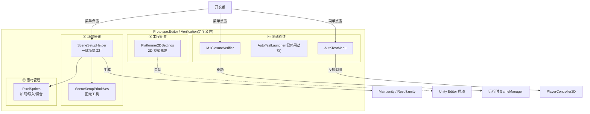
```mermaid
graph TD
    subgraph Editor["Prototype.Editor / Verification(7 个文件)"]
        subgraph Setup["① 场景搭建"]
            SSH["SceneSetupHelper<br/>一键场景工厂"]
            SSP["SceneSetupPrimitives<br/>图元工具"]
        end
        subgraph Assets["② 素材管理"]
            PS["PixelSprites<br/>加载/导入/拼合"]
        end
        subgraph Config["③ 工程配置"]
            P2D["Platformer2DSettings<br/>2D 模式兜底"]
        end
        subgraph Verify["④ 测试验证"]
            ATM["AutoTestMenu"]
            ATL["AutoTestLauncher(已停用劫持)"]
            M1["M1ClosureVerifier"]
        end
    end

    Dev["开发者"]
    Dev -->|菜单点击| SSH
    Dev -->|菜单点击| ATM
    Dev -->|菜单点击| M1
    SSH --> SSP
    SSH --> PS
    SSH -->|生成| Scenes["Main.unity / Result.unity"]
    P2D -.自动.-> Unity["Unity Editor 启动"]
    M1 -->|驱动| Runtime["运行时 GameManager"]
    ATM -->|反射调用| Gameplay["PlayerController2D"]
```

### 9.1 SceneSetupHelper — 一键场景搭建

`SceneSetupHelper.cs`（约 27KB，最大脚本）。菜单 `Prototype/搭建场景/` 下：

| 菜单 | 方法 | 作用 |
|---|---|---|
| 全部（Main + Result） | `BuildAll()` | 调 `PixelSprites.EnsureImportSettings` + 建 Main/Result + 注册进 Build Settings |
| Main（M1 关卡） | `BuildMain()` | 生成 M1 关卡：地面 46 宽 + 4 浮空平台 + 1 移动平台 + 边界墙 + 玩家 + 15 红心 + 3 蓝宝石 + 巡逻敌人 + 火焰陷阱 + 终点旗 + HUD + LevelConfig |
| Result | `BuildResult()` | 生成结算画布（FinalScore/Collect/Stars 文本 + ReplayButton） |

**M1 关卡常量**：`TargetScore=60`，`HeartScore=5`，`GemScore=15`。Kenney 素材索引集中定义（`TileGrassA=0`…`TileFlag=111`、`CharHero=0`、`CharSlimeA=11` 等）。

### 9.2 SceneSetupPrimitives — 场景图元工厂

`SceneSetupPrimitives.cs`。静态工具，从 `SceneSetupHelper` 抽取的重复样板：

| 方法 | 作用 |
|---|---|
| `CreateCamera(orthoSize, bg)` | 正交主相机（纯色背景） |
| `CreateCanvas(name)` | ScreenSpaceOverlay 画布（含 CanvasScaler + GraphicRaycaster） |
| `NewSpriteObject(name, pos, sprite, order)` | 带 SpriteRenderer 的世界对象 |
| `AddFrozenRigidbody(go)` | 冻结旋转的 Rigidbody2D |
| `AddScaledSprite(go, size, sprite, order)` | 按尺寸缩放的 SpriteRenderer |

### 9.3 PixelSprites — 像素素材加载器

`PixelSprites.cs`。

| 成员 | 说明 |
|---|---|
| `TilesDir / CharsDir / BgDir / GenDir` | 素材目录常量 |
| `TilesPPU=36 / CharsPPU=36 / BgPPU=24` | 像素/单位（18px 地砖=0.5 世界单位，24px 角色≈0.67） |
| `Tile(int) / Char(int) / Bg(int)` | 按索引加载精灵 |
| `EnsureImportSettings()` | 批量设置导入器：Sprite、Point 过滤、关 mipmap/压缩、PPU、Repeat wrap |
| `BuildStrip(int[], int)` | 把多个 tile 横向循环拼成一条长纹理保存为 Sprite（减少场景对象数） |

### 9.4 Platformer2DSettings — 2D 模式兜底

`Platformer2DSettings.cs`。`[InitializeOnLoad]`，首次打开工程时用 `SessionState` 幂等地把 `EditorSettings.defaultBehaviorMode` 设为 `Mode2D`（新建 GameObject 默认挂 SpriteRenderer）。

### 9.5 自动测试与验证

| 类 | 文件 | 说明 |
|---|---|---|
| `AutoTestMenu` | `AutoTestMenu.cs` | 菜单 `Prototype/自动通关测试`，进 Play 模式后反射调用 `PlayerController2D.StartAutoTest` |
| `AutoTestLauncher` | `AutoTestLauncher.cs` | `[InitializeOnLoad]`，监听 Play 模式状态；**旧劫持逻辑已注释停用** |
| `M1ClosureVerifier` | `M1ClosureVerifier.cs` | 菜单 `Prototype/验证/M1 通关闭环`：打开 Main → Play → 遍历场景真实收集物逐个 RegisterCollect（期望分数由连击返回值推得，不写死数字）→ 校验 Collected 与 `LevelConfig.totalCollectibles` 一致 → 把玩家放到旗帜上方由 `FlagGoal` 切到 Result → 校验分数/收集数/★★★ → 点再玩一次 → 校验回 Main 且状态重置 → 退出 Play。`Check()` 输出 PASS/FAIL 到 Console |

---

## 10. 关键类与函数速查

### 10.1 单例与全局入口

| 入口 | 类型 | 获取方式 |
|---|---|---|
| `GameManager.Instance` | 全局状态/分数/生命/连击 | `MonoSingleton<GameManager>` 自动创建 |
| `SceneManager.Instance` | 场景加载 | `MonoSingleton<SceneManager>` |
| `EventBus`（静态） | 发布/订阅 | 直接调静态方法 |
| `Sfx`（静态） | 音效 | 先 `Sfx.SetSource(AudioSource)` 注入，再调静态方法 |
| `SpriteAnimUtil`（静态） | 2 帧动画 | 直接调 `TickTwoFrame` |
| `AutoTestUtil`（静态） | 测试工具 | `GatherByNamePrefix/SortByX/Grounded` |

### 10.2 核心玩法函数签名

```csharp
// GameManager
public void ChangeState(GameState newState);
public void AddScore(int amount);
public int RegisterCollect(int delta);   // 返回连击倍率
public bool LoseLife();                   // 返回是否存活
public void ResetScore();
public void MarkWon();

// PlayerController2D（private，内部由 Input 驱动）
private void Update();        // 跳跃缓冲/土狼时间/跳砍/精灵
private void FixedUpdate();   // 水平移动/重力
private void ApplyGravity();  // 非对称重力
private bool IsGrounded();     // 向下射线

// PlayerHealth
public void Damage();

// Collectible2D（private OnTriggerEnter2D 触发）
// PatrolEnemy（OnCollisionEnter2D 按法线判定踩头/侧碰）
// FlagGoal（OnTriggerEnter2D → MarkWon + Load Result）
```

### 10.3 表现层静态工厂

```csharp
FloatingText.Spawn(Vector3 pos, string text, Color color);
CollectBurst.Spawn(Vector3 pos, Color color, int count = 8);
Sfx.Jump(); Sfx.Collect(); Sfx.Hurt(); Sfx.Stomp(); Sfx.Win();
SpriteAnimUtil.TickTwoFrame(ref float timer, float interval, SpriteRenderer sr, Sprite a, Sprite b);
```

---

## 11. 事件索引与跨模块通信

### 11.1 事件发布方 → 订阅方

| 事件 | 发布方 | 订阅方 |
|---|---|---|
| `GameStateChangedEvent` | `GameManager.ChangeState` | （暂无订阅，预留） |
| `ScoreChangedEvent` | `GameManager.AddScore` / `ResetScore` | `HUD.OnScoreChanged` |
| `LivesChangedEvent` | `GameManager.LoseLife` / `ResetScore` / `PlayerHealth.Start` | `HUD.OnLivesChanged` |
| `ComboChangedEvent` | `GameManager.RegisterCollect` / `Update` 超时 / `ResetScore` | `HUD.OnComboChanged` |
| `SceneLoadedEvent` | `SceneManager.Load*` / `ReloadCurrent` | （暂无订阅，预留） |

### 11.2 跨模块依赖关系

```
Gameplay.PlayerController2D ──依赖──▶ Audio.Sfx
Gameplay.PlayerHealth      ──依赖──▶ Core.GameManager / Core.SceneManager / Audio.Sfx
Gameplay.Collectible2D     ──依赖──▶ Core.GameManager / Effects.FloatingText / Effects.CollectBurst / Audio.Sfx
Gameplay.PatrolEnemy       ──依赖──▶ Core.GameManager / Effects.* / Audio.Sfx / PlayerHealth(同层)
Gameplay.FireHazard        ──依赖──▶ PlayerHealth(同层)
Gameplay.FlagGoal         ──依赖──▶ Core.GameManager / Core.SceneManager / Audio.Sfx
Gameplay.MovingPlatform    ──继承──▶ Gameplay.SineBobber
Gameplay.FloatAnim         ──继承──▶ Gameplay.SineBobber
Gameplay.AutoTest*         ──依赖──▶ Gameplay.AutoTestUtil
UI.HUD                    ──依赖──▶ Core.EventBus / Core.GameManager
UI.ResultUI               ──依赖──▶ Core.GameManager / Core.SceneManager
Editor.SceneSetupHelper    ──依赖──▶ 全部运行时命名空间 + Editor.PixelSprites / SceneSetupPrimitives
```

核心层（`Prototype.Core`）**不依赖**任何上层；表现层依赖核心层；编辑器层可依赖全部。

#### 11.2.1 跨模块依赖关系图

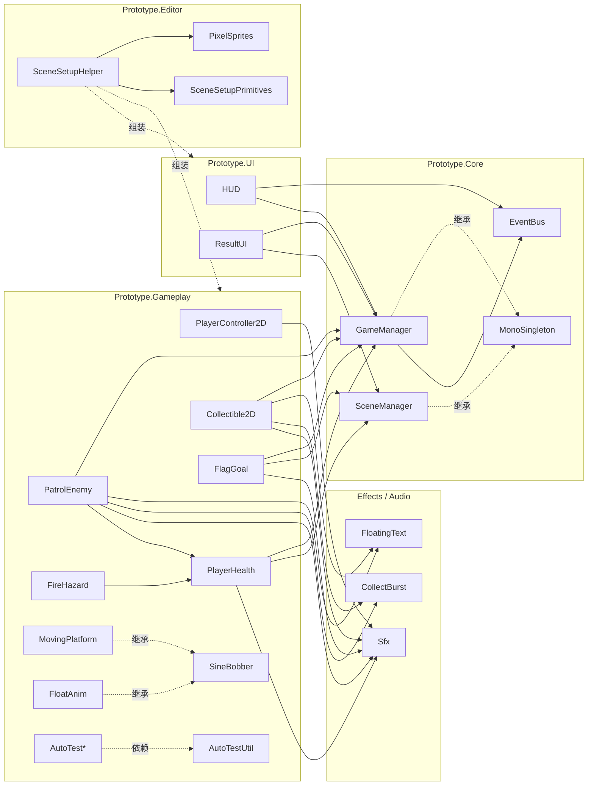
```mermaid
graph LR
    subgraph Core["Prototype.Core"]
        GameManager
        SceneManager2[SceneManager]
        EventBus
        MonoSingleton
    end

    subgraph Gameplay["Prototype.Gameplay"]
        PlayerController2D
        PlayerHealth
        Collectible2D
        PatrolEnemy
        FireHazard
        FlagGoal
        MovingPlatform
        SineBobber
        FloatAnim
        AutoTest["AutoTest*"]
        AutoTestUtil
    end

    subgraph FX["Effects / Audio"]
        FloatingText
        CollectBurst
        Sfx
    end

    subgraph UI["Prototype.UI"]
        HUD
        ResultUI
    end

    subgraph Editor["Prototype.Editor"]
        SceneSetupHelper
        PixelSprites
        SceneSetupPrimitives
    end

    %% Gameplay → Core / FX
    PlayerController2D --> Sfx
    PlayerHealth --> GameManager
    PlayerHealth --> SceneManager2
    PlayerHealth --> Sfx
    Collectible2D --> GameManager
    Collectible2D --> FloatingText
    Collectible2D --> CollectBurst
    Collectible2D --> Sfx
    PatrolEnemy --> GameManager
    PatrolEnemy --> FloatingText
    PatrolEnemy --> CollectBurst
    PatrolEnemy --> Sfx
    PatrolEnemy --> PlayerHealth
    FireHazard --> PlayerHealth
    FlagGoal --> GameManager
    FlagGoal --> SceneManager2
    FlagGoal --> Sfx

    %% 继承
    MovingPlatform -.继承.-> SineBobber
    FloatAnim -.继承.-> SineBobber
    AutoTest -.依赖.-> AutoTestUtil

    %% 单例继承
    GameManager -.继承.-> MonoSingleton
    SceneManager2 -.继承.-> MonoSingleton

    %% UI → Core
    HUD --> EventBus
    HUD --> GameManager
    ResultUI --> GameManager
    ResultUI --> SceneManager2

    %% Core 内部
    GameManager --> EventBus

    %% Editor → 全部
    SceneSetupHelper --> PixelSprites
    SceneSetupHelper --> SceneSetupPrimitives
    SceneSetupHelper -. 组装 .-> Gameplay
    SceneSetupHelper -. 组装 .-> UI
```

#### 11.2.2 事件发布/订阅关系图

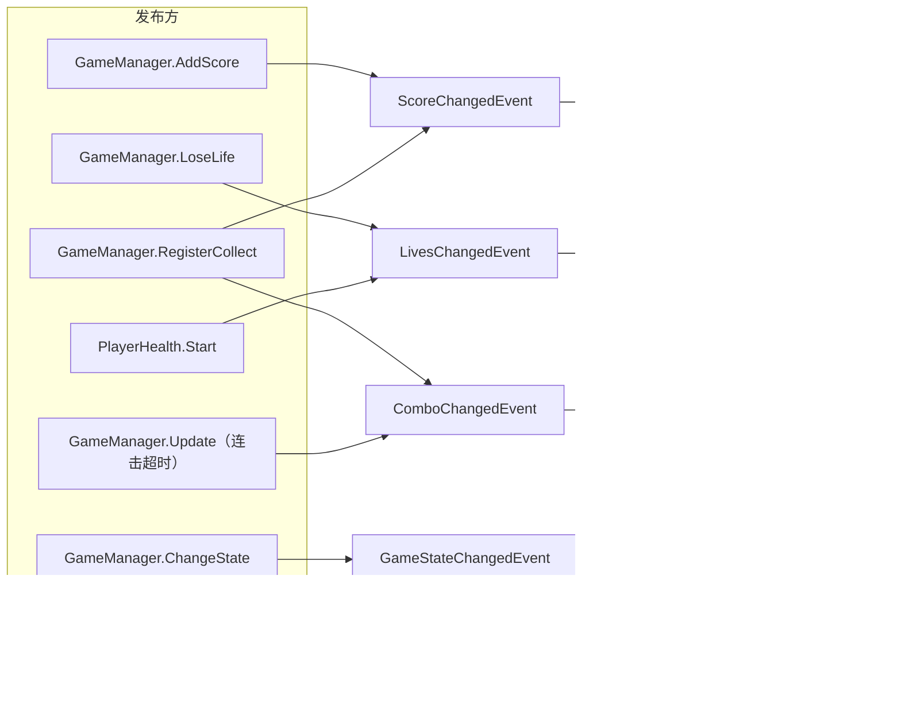
```mermaid
graph LR
    subgraph Publishers["发布方"]
        GM1["GameManager.AddScore"]
        GM2["GameManager.LoseLife"]
        GM3["GameManager.RegisterCollect"]
        GM4["GameManager.ChangeState"]
        GM5["GameManager.Update（连击超时）"]
        GM6["PlayerHealth.Start"]
        SM1["SceneManager.Load*"]
    end

    E1["ScoreChangedEvent"]
    E2["LivesChangedEvent"]
    E3["ComboChangedEvent"]
    E4["GameStateChangedEvent"]
    E5["SceneLoadedEvent"]

    subgraph Subscribers["订阅方"]
        HUD1["HUD.OnScoreChanged"]
        HUD2["HUD.OnLivesChanged"]
        HUD3["HUD.OnComboChanged"]
    end

    GM1 --> E1
    GM3 --> E1
    GM2 --> E2
    GM6 --> E2
    GM3 --> E3
    GM5 --> E3
    GM4 --> E4
    SM1 --> E5

    E1 --> HUD1
    E2 --> HUD2
    E3 --> HUD3
```

---

## 12. 项目运行方式

### 12.1 环境要求

| 项 | 要求 | 说明 |
|---|---|---|
| Unity Editor | **2022.3.62f3c1**（LTS） | 见 `ProjectSettings/ProjectVersion.txt`，必须精确匹配 |
| Unity Hub | 3.x（推荐最新） | 用于安装/管理 Unity 版本与模块 |
| 操作系统 | Windows 10/11、macOS 11+、Ubuntu 20.04+ | 本工程在 Windows 11 + Unity 2022.3.62f3c1 验证 |
| 磁盘空间 | ≥ 5GB（Unity Editor）+ 200MB（工程） | 首次导入会生成 Library 缓存 |
| 显卡 | 支持 DirectX 11 / Metal / Vulkan | 2D 项目要求很低，集成显卡即可 |
| 内存 | ≥ 8GB（推荐 16GB） | 大型场景导入时峰值较高 |
| 外部 SDK | **无** | 无需 Android NDK/JDK、无需 .NET SDK（Unity 内置） |
| 第三方代码包 | **无** | 不依赖 NuGet / UPM 第三方库 |

### 12.2 依赖安装说明

本工程**零外部依赖**：所有玩法逻辑自研，音效/粒子/飘分全部运行时程序化生成。唯一外部素材为 Kenney Pixel Platformer（CC0 授权），已包含在 `Assets/Art/PixelPlatformer/` 内，无需单独下载。

#### 12.2.1 安装 Unity Editor（首次）

```mermaid
flowchart TD
    A([开始]) --> B[下载并安装 Unity Hub]
    B --> C[打开 Unity Hub → 登录/注册 Unity 账号]
    C --> D[Installs → Install Editor]
    D --> E[选择 2022.3.62f3c1（LTS）]
    E --> F{选择模块}
    F -->|Windows| G[Windows Build Support (IL2CPP)]
    F -->|macOS| H[Mac Build Support (IL2CPP)]
    F -->|Linux| I[Linux Build Support]
    F -->|无需构建| J[仅 Editor 即可运行]
    G --> K[完成安装]
    H --> K
    I --> K
    J --> K
    K --> L([Unity Editor 就绪])
```

**详细步骤**：

1. 访问 https://unity.com/download 下载 **Unity Hub** 安装包并安装。
2. 打开 Unity Hub,使用 Unity ID 登录(个人版免费,学生认证可免费使用专业版)。
3. 进入 **Installs** → 点 **Install Editor** → 在弹窗中找到 **2022.3.62f3c1**(LTS 版本)并勾选。
4. 在"Modules"选择界面按需勾选:
   - **仅运行/编辑**:可不勾额外模块,直接点 Install。
   - **要构建可执行文件**:勾选对应平台的 Build Support(IL2CPP + Target Platform)。例如 Windows 64-bit 勾选 `Windows Build Support (IL2CPP)`。
5. 等待下载安装完成(约 10-20 分钟,取决于网速)。

> **版本不匹配怎么办**:若本地只有相近版本(如 2022.3.61f1),可临时改 `ProjectSettings/ProjectVersion.txt` 的版本号强制打开,但不保证兼容。**推荐精确匹配**,避免 API 差异导致编译错误。

#### 12.2.2 Unity Packages 依赖（已在 `Packages/manifest.json` 声明）

以下包随工程自动安装,无需手动操作。Unity 首次打开时会从包缓存(或离线缓存)解析。

| 包 | 版本 | 用途 | 必需 |
|---|---|---|---|
| `com.unity.modules.physics` | 1.0.0 | 3D 物理(脚手架遗留) | 否(可移除) |
| `com.unity.modules.physics2d` | 1.0.0 | **2D 物理(核心)** | **是** |
| `com.unity.modules.ui` | 1.0.0 | uGUI 基础 | **是** |
| `com.unity.ugui` | 1.0.0 | uGUI 完整 | **是** |
| `com.unity.modules.uielements` | 1.0.0 | UI Elements | 否(预留) |
| `com.unity.modules.audio` | 1.0.0 | 音频系统 | **是** |
| `com.unity.modules.animation` | 1.0.0 | 动画系统 | 否 |
| `com.unity.modules.particlesystem` | 1.0.0 | 粒子系统 | 否(脚本自绘) |
| `com.unity.modules.imgui` | 1.0.0 | 编辑器即时 GUI | **是**(编辑器工具) |

> 全部为 Unity **内置模块**(built-in modules),不需要联网下载,随 Editor 安装即提供。

#### 12.2.3 外部素材依赖

| 素材 | 来源 | 授权 | 位置 | 说明 |
|---|---|---|---|---|
| Kenney Pixel Platformer | https://kenney.nl/assets/pixel-platformer | **CC0**(公有领域) | `Assets/Art/PixelPlatformer/` | 501 个像素精灵,已随仓库提供 |
| 内置 `LegacyRuntime.ttf` | Unity 内置 | 随 Editor 提供 | — | `FloatingText` 飘分文字用 |
| `Texture2D.whiteTexture` | Unity 内置 | 随 Editor 提供 | — | `CollectBurst` 粒子用 |
| 程序化音效 | 本工程自研 | — | `Assets/Scripts/Audio/Sfx.cs` | 运行时正弦波合成,无音频文件 |

> 无需额外下载任何素材。若 `Assets/Art/PixelPlatformer/` 丢失,可从 Kenney 官网重新下载(CC0 授权,可商用)。

#### 12.2.4 依赖检查清单

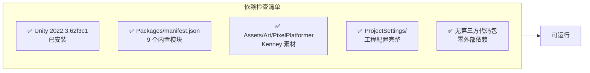
```mermaid
flowchart LR
    subgraph Check["依赖检查清单"]
        T1[✅ Unity 2022.3.62f3c1<br/>已安装]
        T2[✅ Packages/manifest.json<br/>9 个内置模块]
        T3[✅ Assets/Art/PixelPlatformer<br/>Kenney 素材]
        T4[✅ ProjectSettings/<br/>工程配置完整]
        T5[✅ 无第三方代码包<br/>零外部依赖]
    end
    Check --> Ready[可运行]
```

### 12.3 首次运行步骤

1. 用 Unity Hub 以 **2022.3.62f3c1** 打开 `platformer-prototype` 文件夹作为工程根目录。
   - 首次打开时 `Platformer2DSettings.cs` 会自动把 Default Behavior Mode 设为 2D（幂等）。
   - 首次导入会编译脚本、导入素材、生成 Library 缓存,耗时约 2-5 分钟。
2. 菜单栏执行 **`Prototype / 搭建场景 / 全部（Main + Result）`**（`SceneSetupHelper.BuildAll`）。
   - 自动生成 `Assets/Scenes/Main.unity` 与 `Assets/Scenes/Result.unity`，并注册进 Build Settings。
3. 打开 `Main` 场景，点 **Play**。
4. 操作：**A/D 或方向键**移动，**空格**跳跃，按下方向键/S 快速下落；碰撞黄色收集物加分。
5. 通关：**只有触旗这一条路**（`FlagGoal`）→ 进入 `Result` 结算页；点「再玩一次」重置回 `Main`。（`WinCondition` 的“分数达标切场景”是 M1 遗留路径，已于 2026-09-30 删除。）

#### 12.3.1 首次运行流程图

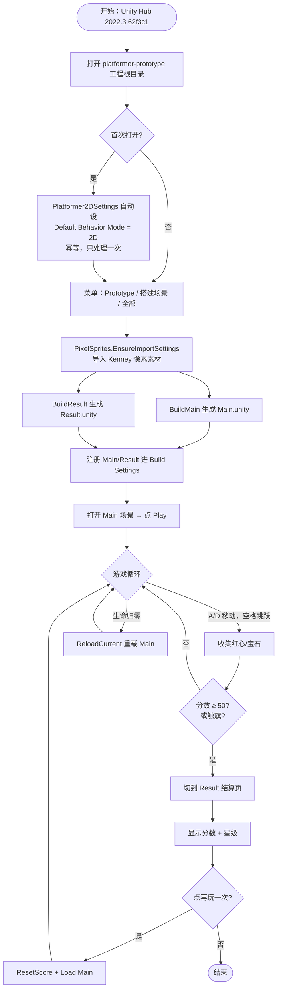
```mermaid
flowchart TD
    A([开始：Unity Hub 2022.3.62f3c1]) --> B[打开 platformer-prototype 工程根目录]
    B --> C{首次打开?}
    C -->|是| D[Platformer2DSettings 自动设<br/>Default Behavior Mode = 2D<br/>幂等，只处理一次]
    C -->|否| E
    D --> E[菜单：Prototype / 搭建场景 / 全部]
    E --> F[PixelSprites.EnsureImportSettings<br/>导入 Kenney 像素素材]
    F --> G[BuildMain 生成 Main.unity]
    F --> H[BuildResult 生成 Result.unity]
    G --> I[注册 Main/Result 进 Build Settings]
    H --> I
    I --> J[打开 Main 场景 → 点 Play]
    J --> K{游戏循环}
    K -->|A/D 移动，空格跳跃| L[收集红心/宝石]
    L --> M{分数 ≥ 50?<br/>或触旗?}
    M -->|否| K
    M -->|是| N[切到 Result 结算页]
    N --> O[显示分数 + 星级]
    O --> P{点再玩一次?}
    P -->|是| Q[ResetScore + Load Main]
    Q --> K
    P -->|否| R([结束])
    K -->|生命归零| S[ReloadCurrent 重载 Main]
    S --> K
```

#### 12.3.2 一键场景搭建流程

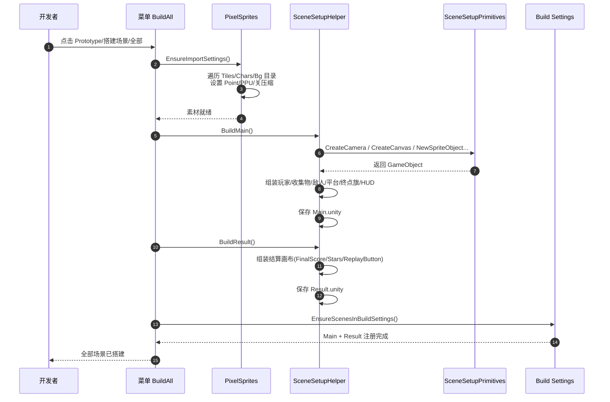
```mermaid
sequenceDiagram
    autonumber
    participant Dev as 开发者
    participant Menu as 菜单 BuildAll
    participant PS as PixelSprites
    participant SSH as SceneSetupHelper
    participant Prims as SceneSetupPrimitives
    participant BS as Build Settings

    Dev->>Menu: 点击 Prototype/搭建场景/全部
    Menu->>PS: EnsureImportSettings()
    PS->>PS: 遍历 Tiles/Chars/Bg 目录<br/>设置 Point/PPU/关压缩
    PS-->>Menu: 素材就绪
    Menu->>SSH: BuildMain()
    SSH->>Prims: CreateCamera / CreateCanvas / NewSpriteObject...
    Prims-->>SSH: 返回 GameObject
    SSH->>SSH: 组装玩家/收集物/敌人/平台/终点旗/HUD
    SSH->>SSH: 保存 Main.unity
    Menu->>SSH: BuildResult()
    SSH->>SSH: 组装结算画布(FinalScore/Stars/ReplayButton)
    SSH->>SSH: 保存 Result.unity
    Menu->>BS: EnsureScenesInBuildSettings()
    BS-->>Menu: Main + Result 注册完成
    Menu-->>Dev: 全部场景已搭建
```

### 12.4 菜单命令速查

| 菜单路径 | 作用 |
|---|---|
| `Prototype/搭建场景/全部（Main + Result）` | 一键搭建并注册场景 |
| `Prototype/搭建场景/Main（M1 关卡）` | 仅搭建 Main |
| `Prototype/自动通关测试` | 进 Play 并启动自动测试（反射调用） |
| `Prototype/验证/M1 通关闭环` | 完整闭环 PASS/FAIL 验证 |

### 12.5 自动化测试

- **运行时**：场景内挂 `AutoPlayTest`，按 **T 键** 启动自动收集。
- **编辑器闭环**：`Prototype/验证/M1 通关闭环`（推荐）—— 遍历场景收集物 → 触旗通关 → 校验分数/收集数/三星 → 校验重置，全程 Console 输出 PASS/FAIL；期望值全部由场景数据推得。

### 12.6 构建可执行文件（可选）

仅运行游戏无需构建。如需分发独立可执行文件:

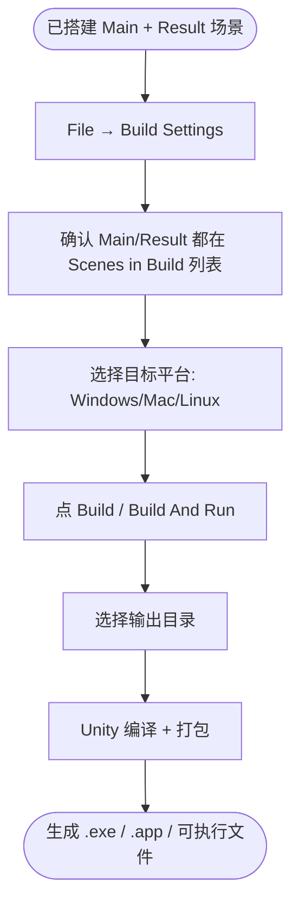
```mermaid
flowchart TD
    A([已搭建 Main + Result 场景]) --> B[File → Build Settings]
    B --> C[确认 Main/Result 都在 Scenes in Build 列表]
    C --> D[选择目标平台: Windows/Mac/Linux]
    D --> E[点 Build / Build And Run]
    E --> F[选择输出目录]
    F --> G[Unity 编译 + 打包]
    G --> H([生成 .exe / .app / 可执行文件])
```

**详细步骤**:

1. 确认已用 `Prototype/搭建场景/全部` 生成 Main/Result 并注册进 Build Settings。
2. 菜单 **File → Build Settings** 打开构建窗口。
3. 确认 **Scenes In Build** 列表包含 `Main.unity` 和 `Result.unity`(搭建菜单已自动添加)。
4. 在 **Platform** 选择目标平台(Windows = PC, Mac & Linux Standalone)。
5. **Architecture**: x86_64(64 位)。
6. 点 **Build**(仅打包) 或 **Build And Run**(打包后立即运行)。
7. 选择输出文件夹,等待编译完成(约 30 秒-2 分钟)。

> **Server Build**: 无图形界面的专用服务器构建不适用本 2D 游戏。请选 Standalone 模式。

### 12.7 克隆与运行（从 git 仓库）

```mermaid
sequenceDiagram
    autonumber
    participant Dev as 开发者
    participant Git as Git 仓库
    participant Hub as Unity Hub
    participant Ed as Unity Editor

    Dev->>Git: git clone <repo-url> platformer-prototype
    Git-->>Dev: 工程源码(含 Assets/Packages/ProjectSettings)
    Note over Dev: 确认 Unity 2022.3.62f3c1 已安装
    Dev->>Hub: Open → 选 platformer-prototype 目录
    Hub->>Hub: 检测 ProjectVersion.txt
    Hub->>Ed: 启动 Unity Editor(2022.3.62f3c1)
    Ed->>Ed: 解析 Packages/manifest.json
    Ed->>Ed: 编译 Assets/Scripts/*.cs
    Ed->>Ed: 导入 Assets/Art 素材
    Ed-->>Dev: 工程就绪
    Dev->>Ed: 菜单 Prototype/搭建场景/全部
    Ed-->>Dev: Main + Result 场景生成
    Dev->>Ed: 打开 Main → Play
```

**命令行操作**:

```bash
# 克隆仓库
git clone <repo-url> platformer-prototype
cd platformer-prototype

# 确认版本
cat ProjectSettings/ProjectVersion.txt
# 期望: m_EditorVersion: 2022.3.62f3c1

# 用 Unity Hub 打开当前目录,后续步骤见 12.3 首次运行
```

### 12.8 常见问题排查

| 问题 | 原因 | 解决方案 |
|---|---|---|
| 打开工程报版本不匹配 | 本地未安装 2022.3.62f3c1 | 在 Unity Hub 安装该版本;或临时改 `ProjectVersion.txt`(不推荐) |
| 菜单 `Prototype` 不出现 | 脚本编译失败 | 看 Console,修复编译错误;确认 `Assets/Editor/*.cs` 存在 |
| 运行时报 `Scene 'Main' not in Build Settings` | 场景未注册 | 跑 `Prototype/搭建场景/全部`,或手动把 Scenes 加进 Build Settings |
| 收集物触碰无反应 | `Collider2D` 未设 Is Trigger | 选中收集物,Collider2D → 勾选 **Is Trigger** |
| 玩家穿模/穿透地面 | Ground 图层未配置 | 选中地面对象,Layer → 选 **Ground**;或 LayerMask 已含 Ground |
| 音效不响 | `Sfx.SetSource` 未注入 | 确认 Player 对象上有 `AudioSource`,且搭建场景已自动注入 |
| `Library/` 体积过大 | 正常导入缓存 | 不要提交进 git;`.gitignore` 已忽略;可随时删除让 Unity 重建 |
| `PixelSprites.Tile(index)` 返回 null | 素材路径不对 | 确认 `Assets/Art/PixelPlatformer/Tiles/tile_XXXX.png` 存在;重跑 EnsureImportSettings |
| Play 模式进入后立刻退出 | 旧版 AutoTestLauncher 劫持 | 已在新版注释停用;若仍存在,删除 `AutoTestLauncher.cs` 或其 GameObject |

### 12.9 输入操作速查

| 操作 | 按键 | 说明 |
|---|---|---|
| 左右移动 | `A`/`D` 或 `←`/`→` | 地面加速,空中弱控制 |
| 跳跃 | `空格` | 支持土狼时间(离台 0.14s 内可跳)+ 跳跃缓冲(落地前 0.18s 按键) |
| 跳砍(短跳) | 跳起后**提前松开空格** | 上升速度乘 0.45,按多久跳多高 |
| 快速下落 | 空中按 `↓`/`S` | 重力变为 3.2,下落上限 -24 |
| 自动测试 | Play 模式按 `T` | 仅当场景挂了 `AutoPlayTest` 时生效 |

---

## 13. 设计要点与约定

### 13.1 解耦与事件驱动

- **EventBus 静态总线**：玩法表现层之间零直接引用，`Collectible2D` 不认识 `HUD`。
- **订阅生命周期**：`OnEnable` 订阅 / `OnDisable` 退订（见 `HUD`），避免静态总线引用已销毁对象泄漏。
- **事件用 `readonly struct`**：不可变、零 GC 分配。

### 13.2 单例约定

- 全局管理器继承 `MonoSingleton<T>`，根节点自动 `DontDestroyOnLoad`，跨场景保留。
- 子类用 `OnAwake()` 初始化，不覆盖 `Awake()`。

### 13.3 2D 适配（与脚手架差异）

| 脚手架（3D） | 本工程（2D） |
|---|---|
| `PlayerController`（CharacterController） | `PlayerController2D`（Rigidbody2D + 跳跃手感） |
| `Collectible`（`OnTriggerEnter`） | `Collectible2D`（`OnTriggerEnter2D`） |
| `CameraFollow`（透视 + LookAt） | `CameraFollow2D`（正交侧视 + Lerp） |
| Plane/Capsule/灯光 | 白色精灵方块 + 正交相机 |

`Core/` 与 `UI/` 引擎无关逻辑原样保留。

### 13.4 资源零依赖策略

- **音效**：`Sfx` 程序化合成，无音频文件。
- **粒子**：`CollectBurst` 用 `Texture2D.whiteTexture`，无贴图依赖。
- **飘分**：`FloatingText` 用内置 `LegacyRuntime.ttf`，无字体依赖。
- **美术**：唯一外部素材为 Kenney CC0 像素包，由 `PixelSprites` 统一导入设置。

### 13.5 关卡数值（M1）

| 项 | 值 |
|---|---|
| 通关方式 | 触旗（`FlagGoal`），无分数通关线 |
| HUD 进度条参照分 / 提示切换分（targetScore） | 60 |
| 红心分值 | 5（共 15 个） |
| 蓝宝石分值 | 15（共 3 个） |
| 踩敌分值 | 10 |
| 最大生命 | 3 |
| 连击窗口 | 4 秒，倍率上限 ×5 |
| 结算星级 | 收集率 ≥60% 1 星 / ≥80% 2 星 / 100% 3 星 |

---

*文档生成自源码静态分析。如代码变更，请同步更新本文档。*
