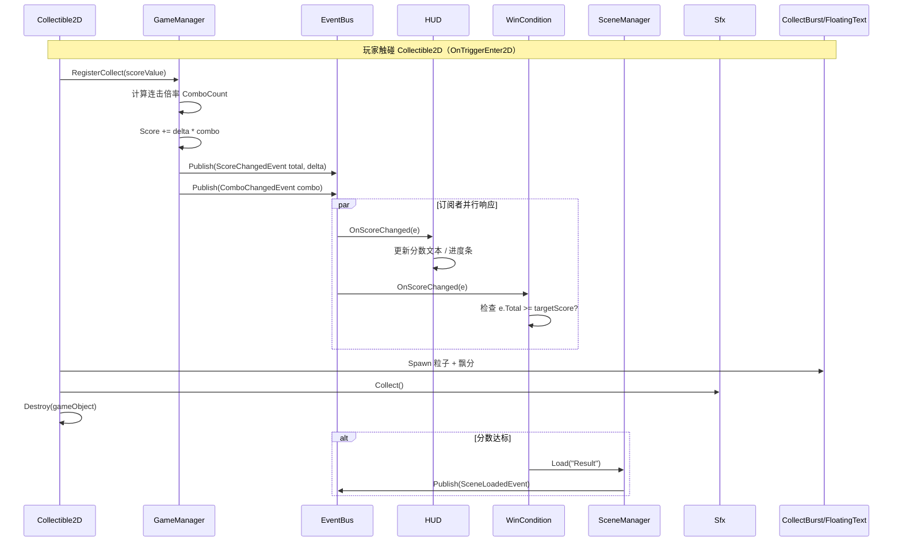

# 01 · 项目架构总览

## 项目定位

**platformer-prototype** 是一个面向大学学期课程的 **Unity 2D 平台跳跃小游戏原型**。
核心目标：一个能玩、可录屏展示的最小可玩版——移动/跳跃/拾取计分/一个完整可通关关卡。

技术路线：
- 原版脚手架是 3D（CharacterController），本项目统一适配为 2D（Rigidbody2D）
- 核心框架（Core / UI）引擎无关，玩法层（Gameplay / Editor）全 2D
- 模块间通过 **静态 EventBus 事件总线** 解耦，零直接引用

---

## 技术栈

| 类别 | 技术 |
|---|---|
| 游戏引擎 | Unity 2022.3.62f3c1 (LTS) |
| 编程语言 | C#（Unity Mono 运行时） |
| 物理引擎 | Box2D（Unity Physics2D） |
| 物理驱动 | Rigidbody2D + BoxCollider2D + CircleCollider2D |
| UI | uGUI（UnityEngine.UI，Screen Space Overlay） |
| 美术资源 | Kenney Pixel Platformer（CC0 授权） |
| 音效 | 全部程序化合成（正弦波 AudioClip.Create） |
| 版本控制 | git + jj（双轨） |
| IDE | Visual Studio 2022 |
| 渲染 | 正交相机 + SpriteRenderer + Point 过滤（像素锐利） |

### Packages 依赖（manifest.json）

本项目 **没有使用任何外部 npm 式 Unity Package**，全部依赖 Unity 内置模块：

```
com.unity.modules.physics           → Physics（仅为兜底）
com.unity.modules.physics2d         → ★ 核心 2D 物理
com.unity.modules.ui                → uGUI
com.unity.modules.uielements        → UI Toolkit（未使用，但内置）
com.unity.ugui                     → uGUI 正式包
com.unity.modules.audio             → AudioClip / AudioSource
com.unity.modules.animation         → 动画系统（未直接使用，保留）
com.unity.modules.particlesystem    → 粒子系统（未使用）
com.unity.modules.imgui             → 图像 UI 基础
```

---

## 目录结构

```
platformer-prototype/
├── Assets/
│   ├── Art/                          # 美术素材
│   │   ├── PixelPlatformer/          # Kenney CC0 像素素材（501 文件）
│   │   │   ├── Tiles/18x18/          # 地砖
│   │   │   ├── Characters/24x24/      # 角色帧
│   │   │   └── Backgrounds/24x24/     # 背景块
│   │   └── Generated/                # 场景搭建时拼接生成的长条贴图
│   ├── Audio/                        # 空 —— 音效全部程序化生成
│   ├── Editor/                       # ★ 编辑器工具（7 个脚本，#if UNITY_EDITOR）
│   │   ├── SceneSetupHelper.cs       #   一键搭建 Main + Result 场景
│   │   ├── SceneSetupPrimitives.cs   #   搭建用图元工厂（相机/画布/刚体）
│   │   ├── PixelSprites.cs           #   Kenney 素材加载 + 像素导入设置 + BuildStrip
│   │   ├── Platformer2DSettings.cs   #   首次打开自动切 2D Default Behavior
│   │   ├── AutoTestMenu.cs           #   Prototype/自动通关测试 菜单入口
│   │   ├── AutoTestLauncher.cs        #   Play 模式自动启动（已停用）
│   │   └── M1ClosureVerifier.cs       #   ★ M1 通关闭环验证器
│   ├── Prefabs/                      # 空 —— 场景搭建时直接组装，未做 Prefab 化
│   ├── Resources/                    # 空 —— 无运行时 Resources.Load 需求
│   ├── Scenes/
│   │   ├── Main.unity                # ★ 主关卡（24x8，10 收集物，6 平台）
│   │   └── Result.unity              #   结算页（分数 + 收集率 + 星级 + 再玩一次）
│   └── Scripts/                      # ★ 26 个 C# 脚本
│       ├── Core/                     #   核心框架（5 个，引擎无关）
│       ├── Gameplay/                 #   2D 玩法（16 个）
│       ├── UI/                       #   HUD + ResultUI（2 个）
│       ├── Effects/                  #   CollectBurst + FloatingText（2 个）
│       ├── Audio/                    #   Sfx.cs（程序化音效合成）
│       └── Utilities/                #   空
├── ProjectSettings/
│   ├── ProjectVersion.txt            # Unity 2022.3.62f3c1
│   └── EditorSettings.asset          # Default Behavior Mode = 2D
├── .gitignore
├── README.md
├── PLAN.md                           # 学期项目计划（里程碑）
├── LEVEL_DESIGN.md                   # M1 关卡设计定稿
├── EXECUTION_PLAN.md                 # 执行计划
├── CHECKLIST_首次运行.md             # 首次运行 Checklist
└── Packages/manifest.json
```

---

## 整体架构图

```mermaid
flowchart TB
    subgraph Unity ["Unity 引擎层"]
        Physics2D["Physics2D<br/>Rigidbody2D / Collider2D"]
        UGUI["uGUI<br/>ScreenSpaceOverlay Canvas"]
        Audio["AudioSource / AudioClip"]
    end

    subgraph Gameplay ["Gameplay 玩法层 · 16 脚本"]
        direction LR
        Player["PlayerController2D<br/>PlayerHealth"]
        Hazard["Collectible2D<br/>PatrolEnemy<br/>FireHazard"]
        Platform["MovingPlatform<br/>FlagGoal<br/>WinCondition"]
        Visual["CameraFollow2D<br/>Parallax / FloatAnim<br/>LevelConfig"]
    end

    subgraph UI ["UI 界面层 · 2 脚本"]
        HUD["HUD<br/>Main 场景实时 UI"]
        ResultUI["ResultUI<br/>结算页"]
    end

    subgraph FX ["Effects + Audio · 3 脚本"]
        CollectBurst["CollectBurst<br/>彩色方块粒子"]
        FloatingText["FloatingText<br/>飘分文字"]
        Sfx["Sfx<br/>正弦波程序化音效"]
    end

    subgraph Core ["Core 核心框架 · 5 脚本"]
        direction LR
        MonoSingleton["MonoSingleton&#60;T&#62;<br/>泛型单例基类"]
        EventBus["EventBus<br/>静态发布/订阅总线"]
        GameManager["GameManager<br/>分数/生命/状态机/连击"]
        SceneManager_Core["SceneManager<br/>场景加载切换"]
    end

    Player --> GameManager
    Player --> Sfx
    Hazard --> GameManager
    Hazard --> CollectBurst
    Hazard --> FloatingText
    Hazard --> Sfx
    Platform --> GameManager
    Platform --> SceneManager_Core
    Platform --> Sfx

    HUD -- "Subscribe ScoreChangedEvent" --> EventBus
    ResultUI -- "直接读取" --> GameManager
    GameManager -- "Publish" --> EventBus

    GameManager -.-> MonoSingleton
    SceneManager_Core -.-> MonoSingleton

    classDef core fill:#3b82f6,stroke:#1e40af,color:#fff
    classDef gameplay fill:#22c55e,stroke:#15803d,color:#fff
    classDef ui fill:#f59e0b,stroke:#b45309,color:#fff
    classDef fx fill:#a855f7,stroke:#6b21a8,color:#fff

    class MonoSingleton,EventBus,GameManager,SceneManager_Core core
    class Player,Hazard,Platform,Visual gameplay
    class HUD,ResultUI ui
    class CollectBurst,FloatingText,Sfx fx
```


---

## 分层设计原则

| 层级 | 依赖方向 | 说明 |
|---|---|---|
| Core | 无依赖 | 纯 C# + UnityEngine（引擎无关），可复用于任何原型 |
| Gameplay | → Core | 调用 GameManager / EventBus / Sfx / Effects |
| UI | → Core | 只订阅事件，不直接引用任何玩法对象 |
| Effects | 无玩法依赖 | 由 Gameplay 主动调用，纯表现层 |
| Audio | 无玩法依赖 | 由 Gameplay 主动调用，纯音效层 |
| Editor | → Core + Gameplay | 仅编译 UNITY_EDITOR，运行时剔除 |

---

## 模块通信机制

### EventBus —— 核心通信中枢

```
发布方（主动发事件）：
  GameManager.RegisterCollect()  →  Publish(ScoreChangedEvent)
  PlayerController2D 跳时          →  Sfx.Jump()（直接调用，不走 EventBus）

订阅方（被动响应）：
  HUD.OnEnable()          →  Subscribe<ScoreChangedEvent>(OnScoreChanged)
  WinCondition.OnEnable() →  Subscribe<ScoreChangedEvent>(OnScoreChanged)
  PlayerHealth.OnEnable() →  Subscribe<LivesChangedEvent>
```

**优点**：新增玩法组件不需要改 Core 或 UI 代码，只需新组件自己 Subscribe。
**注意**：静态 EventBus 不会随场景卸载自动清理，必须在 OnDisable 时 Unsubscribe。

### 直接调用（少量）

- `Sfx.Jump()` / `Sfx.Collect()` 等：音效是**命令式**的，由触发方直接调用更清晰
- `CollectBurst.Spawn()` / `FloatingText.Spawn()`：特效同样是命令式的
- `SceneManager.Instance.Load()`：场景切换由 `FlagGoal` / `WinCondition` 直接调用

---


### 完整数据流时序图（收集物触发）


## 关键设计决策

1. **不用 Prefab**：场景搭建脚本直接组装 GameObject，减少文件数量
2. **不用 Resources.Load**：所有资源路径固定，或由 PixelSprites 直接 AssetDatabase.LoadAssetAtPath
3. **全程序化音效**：不依赖任何外部音频文件
4. **全程序化特效**：CollectBurst 用白色像素 + Sprite.Create，FloatingText 用 TextMesh
5. **泛型单例基类**：MonoSingleton\<T\> 统一 GameManager 和 SceneManager 的单例逻辑
6. **与 UnityEngine.SceneManagement.SceneManager 重名**：在本项目用完全限定名调用引擎 API
7. **自动测试三套实现**：AutoPlayTest / AutoTestManager / AutoTestRunner + M1ClosureVerifier，后者是最终闭环验证方案
