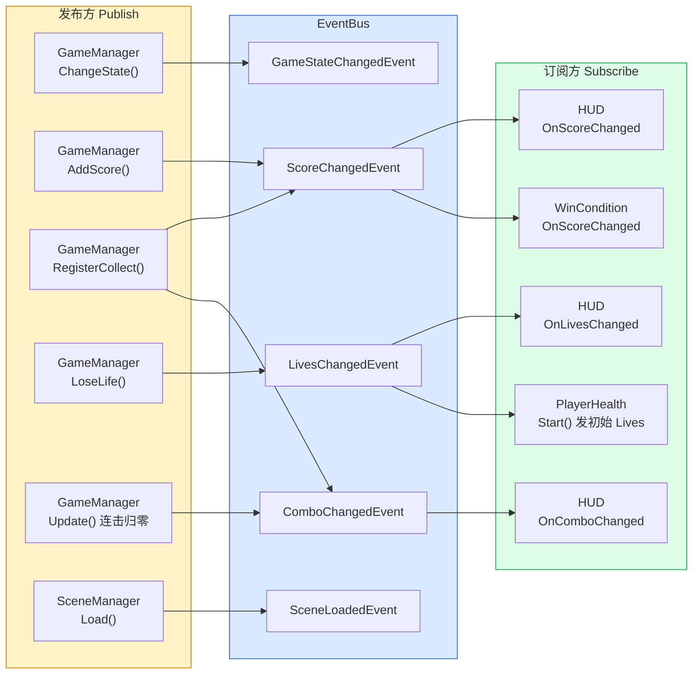
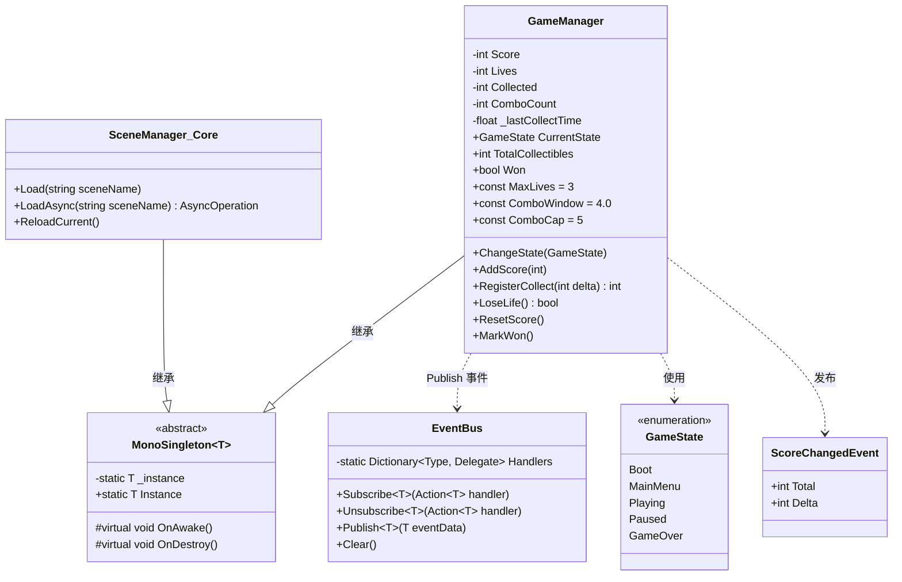

# 02 · 核心框架 Core

命名空间：`Prototype.Core`
目录：`Assets/Scripts/Core/`
文件数：**5 个**

这是整个项目的骨架，引擎无关（不依赖任何 2D 特定组件），理论上可以复用到任何 Unity 原型。

---

## 文件清单

| 文件 | 类/结构 | 职责 |
|---|---|---|
| MonoSingleton.cs | `MonoSingleton<T>` | 泛型单例基类 |
| EventBus.cs | `EventBus`（static class） | 类型安全的发布/订阅总线 |
| Events.cs | 枚举 + 5 个 readonly struct | 事件数据定义 |
| GameManager.cs | `GameManager : MonoSingleton<GameManager>` | 全局状态机 + 分数 + 生命 + 连击 |
| SceneManager.cs | `SceneManager : MonoSingleton<SceneManager>` | 场景加载/切换（与 UnityEngine 重名） |

---

## 2.1 MonoSingleton\<T\> —— 泛型单例基类

**文件**：`Assets/Scripts/Core/MonoSingleton.cs`

Unity 中实现单例的标准套路。本类封装了"查找 → 自动创建 → 去重 → DontDestroyOnLoad"四步，子类只需继承并重写 `OnAwake()`。

```csharp
public abstract class MonoSingleton<T> : MonoBehaviour where T : MonoSingleton<T>
```

### 关键成员

| 成员 | 类型 | 说明 |
|---|---|---|
| `Instance` | `static T` | 懒加载单例。找不到 → new GameObject 自动挂载 |
| `Awake()` | 虚方法 | 处理去重（Destroy 多余实例）、DontDestroyOnLoad、调用 OnAwake |
| `OnAwake()` | 虚方法 | 子类初始化入口（替代 Awake，避免覆盖基类逻辑） |
| `OnDestroy()` | 虚方法 | 清理 `_instance = null` |

### 使用示例

```csharp
public class GameManager : MonoSingleton<GameManager>
{
    protected override void OnAwake()
    {
        Score = 0;
        Lives = MaxLives;
    }
}
```

### 注意事项

- 必须继承 MonoBehaviour
- 放在根节点的 GameObject 上才会自动 DontDestroyOnLoad（子节点不跨场景保留）
- 自动创建时 GameObject 名字 = 类名（如 "GameManager"）

---

## 2.2 EventBus —— 静态事件总线

**文件**：`Assets/Scripts/Core/EventBus.cs`

轻量静态事件总线，用 `Dictionary<Type, Delegate>` 存 handler，编译期类型安全。

### API

```csharp
// 订阅：handler 必须是 Action<T>
EventBus.Subscribe<ScoreChangedEvent>(OnScoreChanged);

// 取消订阅：传入同一个委托实例
EventBus.Unsubscribe<ScoreChangedEvent>(OnScoreChanged);

// 发布：自动广播给所有订阅者
EventBus.Publish(new ScoreChangedEvent(total, delta));

// 清空所有订阅（测试用）
EventBus.Clear();
```

### 实现要点

```csharp
private static readonly Dictionary<Type, Delegate> Handlers;

public static void Subscribe<T>(Action<T> handler)
{
    // 用 Delegate.Combine 合并多播委托
    Handlers[typeof(T)] = (Action<T>)existing + handler;
}
```

- 用泛型 Type 做 key，避免 string key 的拼写错误
- 用 Delegate 存储 → 强类型 → 发布时直接 Invoke，无装箱
- 多播委托合并用 `existing + handler` / `existing - handler`

### 使用模式

```csharp
// 订阅方：OnEnable 里 Subscribe，OnDisable 里 Unsubscribe
private void OnEnable()  => EventBus.Subscribe<ScoreChangedEvent>(OnScoreChanged);
private void OnDisable() => EventBus.Unsubscribe<ScoreChangedEvent>(OnScoreChanged);

private void OnScoreChanged(ScoreChangedEvent e)
{
    scoreText.text = $"分数: {e.Total}";
}
```

### 风险

静态 EventBus 不会随场景卸载自动清理。如果订阅方是场景中的 MonoBehaviour 且没在 OnDisable 里 Unsubscribe，下次场景加载后会调用已销毁对象的方法 → MissingReferenceException。
### EventBus 发布-订阅关系图



---

## 2.3 Events.cs —— 事件定义

**文件**：`Assets/Scripts/Core/Events.cs`

### 事件枚举

```csharp
public enum GameState { Boot, MainMenu, Playing, Paused, GameOver }
```

### 事件结构（全部 readonly struct，零 GC 分配）

| 事件 | 字段 | 发布方 | 主要订阅方 |
|---|---|---|---|
| `GameStateChangedEvent` | `Previous: GameState` + `Current: GameState` | GameManager.ChangeState | （当前无人订阅，保留扩展） |
| `ScoreChangedEvent` | `Total: int` + `Delta: int` | GameManager.AddScore / RegisterCollect | HUD、WinCondition |
| `LivesChangedEvent` | `Lives: int` | GameManager.LoseLife / ResetScore | HUD、PlayerHealth（Start） |
| `SceneLoadedEvent` | `SceneName: string` | SceneManager | （当前无人订阅） |
| `ComboChangedEvent` | `Combo: int` | GameManager.RegisterCollect / Update | HUD |

为什么用 `readonly struct`：
- 作为 EventBus 的泛型参数时，struct 不会装箱（Action<T> 对 T 是值类型时直接栈分配）
- readonly 保证不可变性，消除修改中间状态的隐患
- 比 class 更轻量，零 GC

---

## 2.4 GameManager —— 全局状态管理

**文件**：`Assets/Scripts/Core/GameManager.cs`

单例。负责所有跨场景共享的全局数据。
### 类图




### 常量

| 常量 | 值 | 说明 |
|---|---|---|
| `MaxLives` | 3 | 初始生命 |
| `ComboWindow` | 4.0f | 连击时间窗口（秒） |
| `ComboCap` | 5 | 连击倍率上限（最高 x5） |

### 数据属性

| 属性 | 类型 | 初始值 | 说明 |
|---|---|---|---|
| `CurrentState` | GameState | Boot | 游戏状态机 |
| `Score` | int | 0 | 当前分数 |
| `Lives` | int | MaxLives (3) | 当前生命 |
| `Collected` | int | 0 | 已收集数量 |
| `TotalCollectibles` | int | 0 | 本关收集物总数（由 LevelConfig 注入） |
| `Won` | bool | false | 是否已通关 |
| `ComboCount` | int | 1 | 当前连击倍率 |

### 公共方法

| 方法 | 发布事件 | 说明 |
|---|---|---|
| `ChangeState(GameState)` | GameStateChangedEvent | 切换游戏状态（Boot → Playing → GameOver） |
| `AddScore(int)` | ScoreChangedEvent | 基础加分（PatrolEnemy 击杀 +10 用） |
| `RegisterCollect(int delta)` | ScoreChangedEvent + ComboChangedEvent | 带连击的收集加分（返回本次 ComboCount） |
| `LoseLife()` | LivesChangedEvent | 扣 1 生命，返回是否存活 |
| `ResetScore()` | ScoreChangedEvent + LivesChangedEvent + ComboChangedEvent | 全部归零并回到初始状态 |
| `MarkWon()` | — | 标记通关 |

### 连击机制详解

```
RegisterCollect(delta):
  1. Collected++
  2. if (距上次收集 <= 4s) → ComboCount = min(5, ComboCount+1)
     else                    → ComboCount = 1
  3. 最终加分 = delta * ComboCount
  4. 重置上次收集时间
  5. Publish(ScoreChangedEvent) + Publish(ComboChangedEvent)
```

Update 里每帧检查：
- 如果 ComboCount > 1 且距上次收集 > 4s → 自动归零

---

## 2.5 SceneManager —— 场景管理

**文件**：`Assets/Scripts/Core/SceneManager.cs`

单例。与 `UnityEngine.SceneManagement.SceneManager` **同名**，所以内部统一用完全限定名调用引擎 API。

### 方法

| 方法 | 说明 |
|---|---|
| `Load(string sceneName, LoadSceneMode)` | 按名字加载场景 |
| `Load(int sceneIndex, LoadSceneMode)` | 按索引加载场景 |
| `LoadAsync(string sceneName)` | 异步加载，返回 AsyncOperation |
| `ReloadCurrent()` | 重载当前场景 |

每个方法都会 Publish `SceneLoadedEvent`。

### 使用场景

- `FlagGoal` 触旗 → `SceneManager.Instance.Load("Result")`
- `WinCondition` 分数达标 → `SceneManager.Instance.LoadAsync("Result")`
- `PlayerHealth.Die()` → `SceneManager.Instance.ReloadCurrent()`
- `ResultUI.OnReplay()` → `SceneManager.Instance.Load("Main")`

### Build Settings 要求

Main 和 Result 必须注册进 Build Settings，否则 `Load("Result")` 会报 "Scene could not be loaded"。`SceneSetupHelper.EnsureScenesInBuildSettings()` 已在搭建场景时自动处理。
