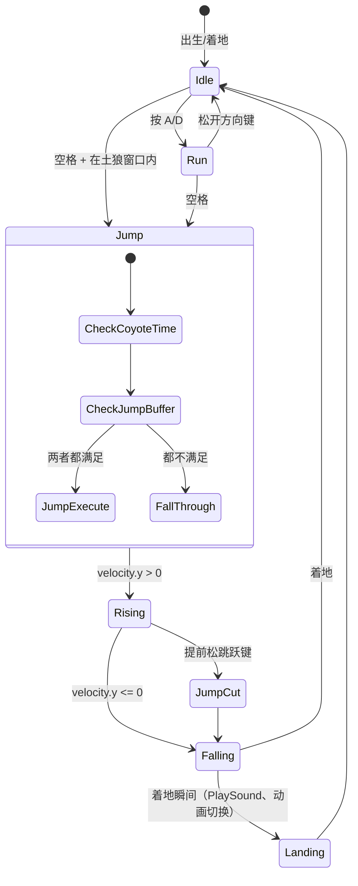
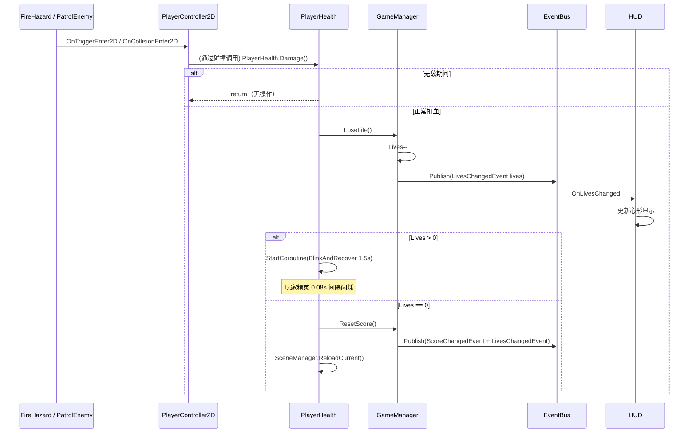
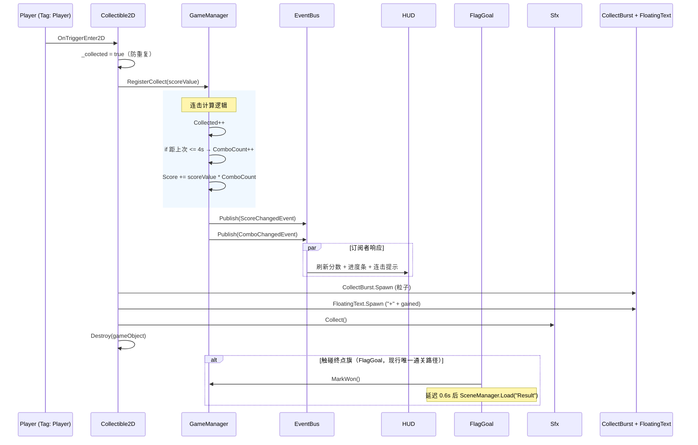
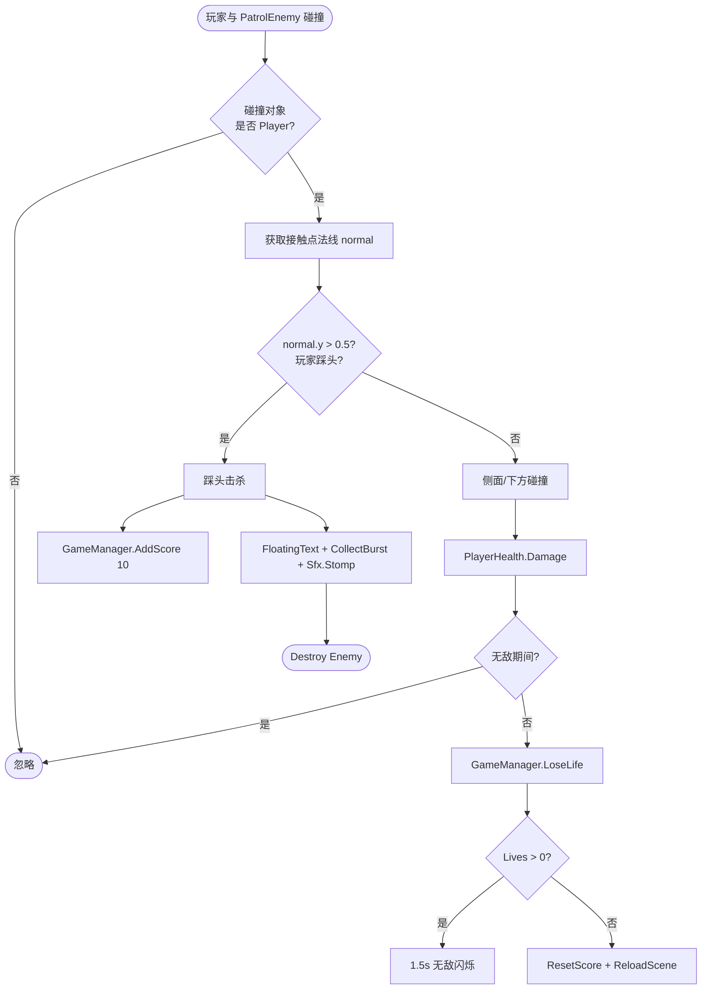

# 03 · 玩法系统 Gameplay

命名空间：`Prototype.Gameplay`
目录：`Assets/Scripts/Gameplay/`
文件数：**16 个**

这是项目的主体，所有 2D 平台跳跃相关的玩法逻辑都在这里。

---

## 文件清单

| 文件 | 类 | 说明 |
|---|---|---|
| PlayerController2D.cs | `PlayerController2D` | 玩家控制核心（移动 + 跳跃 + 容错 + 非对称重力 + 朝向翻转） |
| PlayerHealth.cs | `PlayerHealth` | 生命管理（扣血 + 无敌闪烁 + 归零重置） |
| Collectible2D.cs | `Collectible2D` | 可收集物（触发 → 连击加分 → 飘分 → 粒子 → 自毁） |
| PatrolEnemy.cs | `PatrolEnemy` | 地面巡逻敌人（踩头击杀 vs 侧面受伤） |
| FireHazard.cs | `FireHazard` | 静态火焰陷阱（2 帧动画 + 触发/碰撞受伤） |
| MovingPlatform.cs | `MovingPlatform` | 上下浮动平台（玩家踩踏时自动携带） |
| FlagGoal.cs | `FlagGoal` | 终点旗帜（触旗通关 + 延迟切换 Result） |
| CameraFollow2D.cs | `CameraFollow2D` | 正交相机平滑跟随 |
| Parallax.cs | `Parallax` | 2D 水平视差背景 |
| FloatAnim.cs | `FloatAnim` | 收集物上下浮动动画 |
| SineBobber.cs | `SineBobber` (abstract) | 正弦浮动基类（供 FloatAnim / MovingPlatform 复用） |
| LevelConfig.cs | `LevelConfig` | 关卡收集物总数注入 GameManager |
| SpriteAnimUtil.cs | `SpriteAnimUtil` (static) | 2 帧精灵动画的公共工具 |
| AutoPlayTest.cs | `AutoPlayTest` | 自动通关测试（按 T 键启动） |
| AutoTestUtil.cs | `AutoTestUtil` (static) | 自动测试公共工具（GatherByNamePrefix / SortByX / Grounded） |

---

## 3.1 PlayerController2D —— 玩家控制核心

**文件**：`Assets/Scripts/Gameplay/PlayerController2D.cs`

整个项目最重要的脚本，手感好坏全在这里。`RequireComponent(typeof(Rigidbody2D))`。

### 序列化字段

#### 移动参数

| 字段 | 默认值 | 说明 |
|---|---|---|
| `moveSpeed` | 5.5f | 最大水平速度 |
| `jumpForce` | 8.6f | 跳跃初速度 |
| `groundAccel` | 55f | 地面加速率 |
| `airControl` | 0.55f | 空中控制系数（空中加速率 = groundAccel * airControl） |
| `jumpCutMultiplier` | 0.45f | 提前松键的跳砍倍率 |

#### 非对称重力

| 字段 | 默认值 | 说明 |
|---|---|---|
| `riseGravityScale` | 1.15f | 上升时重力（轻 → 跳得高） |
| `fallGravityScale` | 2.0f | 正常下落重力（重 → 落地干脆） |
| `fastFallGravity` | 3.2f | 按住 ↓ 快速下落的重力 |
| `maxFallSpeed` | -16f | 正常下落的速度上限 |
| `fastFallMaxSpeed` | -24f | 快速下落的速度上限 |

#### 容错机制

| 字段 | 默认值 | 说明 |
|---|---|---|
| `groundCheckDistance` | 0.45f | 向下射线检测距离 |
| `coyoteTime` | 0.14f | **土狼时间**（离开平台后仍可跳跃的时间窗口） |
| `jumpBufferTime` | 0.18f | **跳跃缓冲**（按跳跃键后短时间内自动起跳） |
| `groundMask` | (自动解析为 Ground 图层) | 地面检测目标层 |
| `groundCheck` | (自动用自身位置) | 射线起点 Transform |

#### 动画

| 字段 | 说明 |
|---|---|
| `idleSprite` | 站立/着地精灵 |
| `jumpSprite` | 跳跃精灵 |
| `bodyRenderer` | 角色 SpriteRenderer 引用 |


### 玩家状态机



### 核心算法### 核心算法

#### 输入处理（Update）

```csharp
void Update()
{
    // 1. 跳跃缓冲：记录按键时间戳
    if (Input.GetButtonDown("Jump")) _jumpBufferCounter = jumpBufferTime;
    else _jumpBufferCounter -= Time.deltaTime;

    // 2. 记录最后着地时间（土狼时间基准）
    if (IsGrounded()) _lastGroundedTime = Time.time;

    // 3. 跳跃：缓冲时间 > 0 且 在土狼窗口内 → 起跳
    if (_jumpBufferCounter > 0 && Time.time - _lastGroundedTime <= coyoteTime)
    {
        _rb.velocity.y = jumpForce;
        _jumpBufferCounter = -1f;  // 消费缓冲
        Sfx.Jump();
    }
    // 4. 跳砍：空中提前松键 → 骤减上升速度
    else if (Input.GetButtonUp("Jump") && _rb.velocity.y > 0f)
    {
        _rb.velocity.y *= jumpCutMultiplier;
    }

    UpdateSprite();
}
```

#### 水平移动 + 重力（FixedUpdate）

```csharp
void FixedUpdate()
{
    float h = Input.GetAxisRaw("Horizontal");
    float accel = IsGrounded() ? groundAccel : groundAccel * airControl;
    _rb.velocity.x = Mathf.MoveTowards(_rb.velocity.x, h * moveSpeed, accel * Time.fixedDeltaTime);

    ApplyGravity();  // 根据上升/下落/快速下落切换重力系数

    // 水平翻转
    if (h > 0.05f && !_facingRight) Flip();
    else if (h < -0.05f && _facingRight) Flip();
}
```

#### 非对称重力

```
if (按住↓ 且 在下落中)
    gravityScale = 3.2   // 快速下落
elif (velocity.y > 0.5)
    gravityScale = 1.15  // 上升轻
else
    gravityScale = 2.0   // 下落重
```

配合速度上限：正常下落 ≤ -16，快速下落 ≤ -24。

#### 地面检测

```csharp
bool IsGrounded() =>
    Physics2D.Raycast(groundCheck.position, Vector2.down, groundCheckDistance, groundMask).collider != null;
```

### 输入映射

- Unity Input 管理器默认配置已满足：
  - Horizontal：A/D + ←/→
  - Jump：Space

---


### 玩家受伤-扣血流程


## 3.2 PlayerHealth —— 生命系统

**文件**：`Assets/Scripts/Gameplay/PlayerHealth.cs`

### 序列化字段

| 字段 | 默认值 | 说明 |
|---|---|---|
| `invincibleTime` | 1.5f | 受伤后无敌时间 |
| `blinkInterval` | 0.08f | 无敌期间的闪烁间隔 |
| `resetLevelOnDeath` | true | 生命归零时是否重置关卡 |

### 关键方法

- `Damage()`：扣 1 血 → 播放 Hurt 音效 → 开始无敌闪烁协程
- `Die()`：GameManager.ResetScore() + SceneManager.ReloadCurrent()
- 闪烁协程：每 blinkInterval 秒切 visible，无敌结束恢复正常

### 事件订阅

- `Start()` 时 Publish `LivesChangedEvent`（让 HUD 初始显示心形）

---

## 3.3 Collectible2D —— 收集物

**文件**：`Assets/Scripts/Gameplay/Collectible2D.cs`

触发式收集。`OnTriggerEnter2D` 是 2D 版本的 OnTriggerEnter。

```

### 收集物触发时序图


触发流程：
  1. 标记 _collected（防重复）
  2. GameManager.RegisterCollect(scoreValue)   // 带连击
  3. FloatingText.Spawn("+" + gained)
  4. CollectBurst.Spawn(彩色粒子)
  5. Sfx.Collect()
  6. Destroy(gameObject)
```

连击 ≥ 3 时飘分文字和粒子颜色会变成金黄（combo 高亮）。

---

## 3.4 PatrolEnemy —— 地面巡逻敌人

**文件**：`Assets/Scripts/Gameplay/PatrolEnemy.cs`

`RequireComponent(typeof(Rigidbody2D))`。

### 行为

```
- 在 [minX, maxX] 区间左右来回移动
- 2 帧精灵动画
- 朝向随移动方向翻转
```


### 敌人碰撞决策流程图



### 碰撞处理### 碰撞处理

```csharp
OnCollisionEnter2D(Collision2D):
  if (玩家接触法线朝上 normal.y > 0.5)
      → 玩家踩头 → 消灭敌人 + +10 分
  else
      → 侧面/下方碰撞 → PlayerHealth.Damage()
```

击杀反馈：FloatingText("+10") + CollectBurst + Sfx.Stomp() + Destroy。

---

## 3.5 FireHazard —— 静态火焰陷阱

**文件**：`Assets/Scripts/Gameplay/FireHazard.cs`

`RequireComponent(typeof(Collider2D))`。

- 2 帧动画（用 SpriteAnimUtil.TickTwoFrame）
- OnTriggerEnter2D + OnCollisionEnter2D 双保险 → PlayerHealth.Damage()
- PlayerHealth 的无敌时间防止连续扣血

---

## 3.6 MovingPlatform —— 移动平台

**文件**：`Assets/Scripts/Gameplay/MovingPlatform.cs`

继承自 `SineBobber`，上下浮动。

### 关键：玩家携带

```csharp
OnCollisionStay2D(Collision2D):
  if (玩家在平台上方 y > 平台中心 + 0.05)
      player.transform.SetParent(transform, true)  // 成为平台子对象

OnCollisionExit2D(Collision2D):
      player.transform.SetParent(null, true)       // 离开后恢复独立
```

这是 Unity 2D 移动平台的标准实现——用 SetParent 让玩家随平台一起移动。

---

## 3.7 FlagGoal —— 终点旗帜

**文件**：`Assets/Scripts/Gameplay/FlagGoal.cs`

触旗通关。`settleDelay = 0.6f` 延迟切换 Result，让胜利音效播完。

```
OnTriggerEnter2D:
  1. 标记 _triggered（防重复）
  2. GameManager.MarkWon()
  3. Sfx.Win()
  4. Invoke("GoToResult", 0.6f)
  5. SceneManager.Instance.Load("Result")
```

**当前项目的过关机制只有一套**：
1. `FlagGoal` —— 触旗切 Result（旧版 `WinCondition` 的分数达标路径已于 2026-09-30 删除）

Main 场景**只挂 FlagGoal**：按组件清单实测，Main.unity 里 FlagGoal×1，分数达标不会切场景。

---

## 3.8 WinCondition —— 分数过关条件（已移除）

**已于 2026-09-30 删除**。

原设计是「分数达标 → 切 Result」的 M1 过关路径：`OnEnable` 订阅 `ScoreChangedEvent`，`e.Total >= targetScore` 就 `Load(nextSceneName)`。它与 §3.7 `FlagGoal` 的触旗通关互斥，且从未挂载在 Main 场景（组件清单实测 FlagGoal×1、WinCondition×0）。现行过关判定只认 §3.7 `FlagGoal`，星级由收集率决定。

---

## 3.9 CameraFollow2D —— 相机跟随

**文件**：`Assets/Scripts/Gameplay/CameraFollow2D.cs`

正交侧视相机的平滑跟随。

```csharp
void LateUpdate()
{
    float desiredY = lockY > -998f ? lockY : target.position.y;
    transform.position = Vector3.Lerp(current, desired, smooth * deltaTime);
}
```

`lockY = -999f` 表示不锁 Y（跟随玩家高度变化）。非 -999 时 Y 固定，横向关卡更稳。

---

## 3.10 Parallax —— 背景视差

**文件**：`Assets/Scripts/Gameplay/Parallax.cs`

2D 横版游戏标配。水平视差（Y 不移动）。

```csharp
transform.position = _base + new Vector3(
    offset.x * (1f - factor),  // factor=1 → 完全固定；factor=0 → 完全跟随
    0f, 0f);
```

### M1 关卡视差层

| 层 | factor | 说明 |
|---|---|---|
| 天空 | (钉在相机上) | 永远覆盖 |
| 远山 | 0.9 | 几乎不动 |
| 远景树 | 0.75 | 慢速移动 |
| 云 | 0.55 | 中速移动 |
| 地面 | 1.0 | 完全固定（默认，不需要 Parallax 脚本） |

---

## 3.11 其他 Gameplay 脚本

### FloatAnim : SineBobber —— 收集物浮动

继承 SineBobber，让收集物做上下轻微浮动（幅度 0.1，速度 2），增加视觉动感。

### LevelConfig —— 关卡配置

进入场景时把本关收集物总数注入 GameManager.TotalCollectibles，供结算页计算收集率。

### SineBobber（abstract）—— 正弦浮动基类

```csharp
protected abstract float Amplitude { get; }
protected abstract float Speed { get; }

protected void ApplyBob()
{
    float offset = Mathf.Sin(Time.time * Speed + _phase) * Amplitude;
    transform.position = _base + Vector3.up * offset;
}
```

Phase 随机初始化，避免所有对象整齐划一。

### SpriteAnimUtil —— 2 帧动画工具

```csharp
public static void TickTwoFrame(
    ref float timer, float interval,
    SpriteRenderer sr, Sprite frameA, Sprite frameB)
```

Timer 是 ref 参数，达到间隔时翻帧。

---

## 3.12 自动测试工具集

### 设计背景

自动测试实现现存 1 套（`AutoPlayTest` + `AutoTestUtil`）+ 1 套闭环验证器；另有两套旧实现（`AutoTestManager` / `AutoTestRunner`）已于 2026-09-30 删除，说明作者在测试策略上迭代过。

| 工具 | 状态 | 触发方式 | 说明 |
|---|---|---|---|
| AutoPlayTest | 可用 | 场景中挂脚本 + 按 T 键 | 通用收集 → 排序 → 逐个取 |
| M1ClosureVerifier | ★ 推荐 | 菜单 Prototype/验证/M1 通关闭环 | 最完整的端到端验证 |
| AutoTestUtil | 支撑工具 | 被其他测试脚本引用 | 公共逻辑（Gather/Sort/Grounded） |

### AutoTestUtil 公共方法

| 方法 | 说明 |
|---|---|
| `GatherByNamePrefix(List<Vector3> into, string prefix)` | 遍历场景 Transform，名字以 prefix 开头的加入列表 |
| `SortByX(List<Vector3>)` | 按 x 坐标从左到右排序 |
| `Grounded(Vector3 from, float distance, LayerMask mask)` | 向下射线检测着地 |

### M1ClosureVerifier 验证流程

```
菜单触发 → 打开 Main → EnterPlay
  → 逐个读取场景中真实的 Collectible2D，用其自身 scoreValue 调 gm.RegisterCollect()，期望分数由连击返回值累加得出
  → 等待切 Result（6s 超时）
  → 校验 Result 显示 "最终分数: 80"
  → 点击 ReplayButton
  → 等待切回 Main（6s 超时）
  → 校验 gm.Score == 0
  → 退出 Play，输出 PASS/FAIL
```
