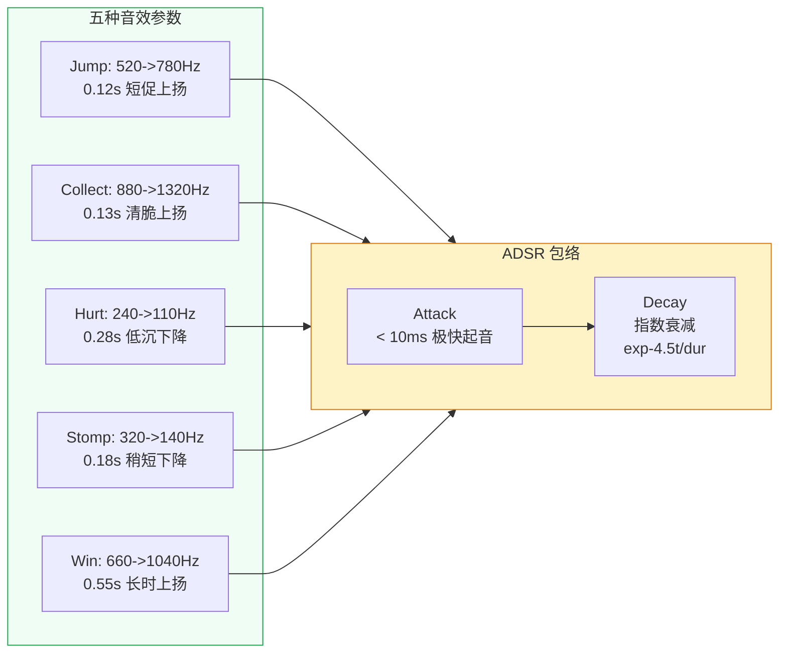

# 05 · 特效与音频

命名空间：`Prototype.Effects` + `Prototype.Audio`
目录：`Assets/Scripts/Effects/` + `Assets/Scripts/Audio/`
文件数：**3 个**（CollectBurst + FloatingText + Sfx）

整个项目的表现层全部是 **100% 程序化** 实现，没有任何外部特效/音频资源文件。

---

## 文件清单

| 文件 | 类 | 命名空间 | 说明 |
|---|---|---|---|
| CollectBurst.cs | `CollectBurst` | Prototype.Effects | 收集时的彩色方块粒子爆发 |
| FloatingText.cs | `FloatingText` | Prototype.Effects | 飘分文字（TextMesh 世界空间） |
| Sfx.cs | `Sfx` (static class) | Prototype.Audio | 程序化音效合成（正弦波） |

---

## 5.1 CollectBurst —— 彩色方块粒子

**文件**：`Assets/Scripts/Effects/CollectBurst.cs`

### 静态接口

```csharp
public static void Spawn(Vector3 pos, Color color, int count = 8)
```

### 实现原理

完全不需要 Prefab 或粒子系统，纯代码创建：

```
对 count 次：
  1. new GameObject("Burst")
  2. position = pos + Random.insideUnitCircle * 0.12（随机散布）
  3. AddComponent<SpriteRenderer>
     - sprite = White()（Unity 内置白色像素纹理）
     - color = 传入颜色
     - sortingOrder = 30
  4. AddComponent<CollectBurst>（自身行为）
     - _vel = Random 速度（向上为主）
     - _life = 0.35 ~ 0.55s
```

White() 静态缓存：用 `Texture2D.whiteTexture` + `Sprite.Create` 生成一个 1x1 白色 Sprite。

### 运行时行为（Update）

```
- _life -= deltaTime
- 如果 _life <= 0 → Destroy(gameObject)
- _vel.y -= 7f * deltaTime（重力下坠）
- position += vel * deltaTime
- SpriteRenderer.color.a = Mathf.Clamp01(_life * 2.5f)（淡出）
```

### 调用场景

| 场景 | 颜色 | 数量 |
|---|---|---|
| Collectible2D 收集（combo < 3） | 粉红色 (1, 0.5, 0.7) | 8 |
| Collectible2D 收集（combo ≥ 3） | 金黄色 (1, 0.8, 0.25) | 8 |
| PatrolEnemy 击杀 | 浅绿色 (0.55, 0.9, 0.6) | 6 |

---

## 5.2 FloatingText —— 飘分文字

**文件**：`Assets/Scripts/Effects/FloatingText.cs`

### 静态接口

```csharp
public static void Spawn(Vector3 pos, string text, Color color)
```

### 实现原理

用 `TextMesh`（不是 uGUI Text）渲染文字，因为：
- TextMesh 是世界空间对象，不需要 Canvas
- 2D 正交相机场景里更轻量

```
创建 GameObject("FlyText")：
  1. position = pos + Random + (0, 0.35, 0)
  2. localScale = 0.08（TextMesh 默认像素很大，缩小到适合 2D 场景）
  3. AddComponent<TextMesh>
     - font = LegacyRuntime.ttf（Unity 内置）
     - fontSize = 56
     - anchor = MiddleCenter
  4. AddComponent<FloatingText>（自身行为）
     - _vel = (随机±0.15, 1.4, 0)（主要向上飘）
```

### 运行时行为

```
- _life = 0.9s
- position += vel * deltaTime（上飘 + 微水平漂移）
- TextMesh.color.a = Mathf.Clamp01(_life / 0.45f)（后期淡出）
- _life <= 0 → Destroy
```

### 调用场景

| 场景 | 文字 | 颜色 |
|---|---|---|
| Collectible2D 收集 | `+{score}`（含 combo 倍率） | combo ≥ 3 金黄色，否则白色 |
| PatrolEnemy 击杀 | `+10` | 浅绿 (0.7, 1, 0.7) |

---

## 5.3 Sfx —— 程序化音效合成

**文件**：`Assets/Scripts/Audio/Sfx.cs`

**100% 代码合成**，不使用任何 .wav / .ogg 文件。

### 静态接口

```csharp
// 必须在场景初始化时注入 AudioSource
Sfx.SetSource(playerAudioSource);

// 以下方法随时调用
Sfx.Jump();      // 跳跃
Sfx.Collect();   // 收集
Sfx.Hurt();      // 受伤
Sfx.Stomp();     // 踩敌
Sfx.Win();       // 通关
```

### 合成算法

```csharp
private static AudioClip MakeTone(float f0, float f1, float dur, float vol)
{
    int sr = 22050;                              // 采样率
    int n = Mathf.CeilToInt(sr * dur);           // 总采样数
    var data = new float[n];

    for (int i = 0; i < n; i++)
    {
        float t = i / (float)sr;
        float f = Mathf.Lerp(f0, f1, t / dur);    // 频率线性插值（扫频）
        float env = Mathf.Min(1f, t / 0.01f)     // 起音：极快 Attack
                    * Mathf.Exp(-4.5f * t / dur); // 包络：指数衰减
        data[i] = Mathf.Sin(2f * PI * f * t) * env * vol;
    }

    var clip = AudioClip.Create("sfx", n, 1, sr, false);
    clip.SetData(data, 0);
    return clip;
}
```

### 各音效参数

| 音效 | f0 (起点频率) | f1 (终点频率) | duration | volume | 听感 |
|---|---|---|---|---|---|
| Jump | 520 Hz | 780 Hz | 0.12s | 0.35 | 短促上扬"嗖" |
| Collect | 880 Hz | 1320 Hz | 0.13s | 0.3 | 清脆上扬"叮" |
| Hurt | 240 Hz | 110 Hz | 0.28s | 0.45 | 低沉下降"嗡" |
| Stomp | 320 Hz | 140 Hz | 0.18s | 0.4 | 稍短下降"咚" |
| Win | 660 Hz | 1040 Hz | 0.55s | 0.5 | 长时上扬"叮～" |


### Sfx 程序化合成流程图

```mermaid
flowchart TD
    Start([Gameplay 脚本调用<br/>Sfx.Jump / Collect / Hurt / Stomp / Win]) --> CheckCache{缓存 clip<br/>是否已存在?}
    CheckCache -- 是 --> PlayCached[_src.PlayOneShot(clip)]
    CheckCache -- 否 --> MakeTone[调用 MakeTone f0, f1, dur, vol]
    
    MakeTone --> Init[采样率 sr = 22050<br/>总采样数 n = sr * dur]
    Init --> Loop[for i in 0..n<br/>逐采样计算]
    Loop --> CalcT[t = i / sr<br/>f = Lerp(f0, f1, t/dur)]
    CalcT --> Env[包络 env = min(1, t/0.01)<br/>* exp(-4.5 * t/dur)]
    Env --> Sample[data[i] = sin(2πft) * env * vol]
    Sample --> Loop
    Loop --> Done[AudioClip.Create<br/>n samples, mono<br/>SetData]
    Done --> Cache[缓存到 _jump / _collect / ...]
    Cache --> PlayCached
    PlayCached --> End([播放完毕])
```

### 各音效参数可视化


### AudioSource 注入

SceneSetupHelper.CreatePlayer 时：

```csharp
var audioSrc = go.AddComponent<AudioSource>();
audioSrc.playOnAwake = false;
audioSrc.spatialBlend = 0f;  // 2D 无空间衰减
Sfx.SetSource(audioSrc);
```

AudioClip 是懒创建的——第一次调用时才 MakeTone，之后缓存复用。

---

## 无外部资源的意义

| 好处 | 说明 |
|---|---|
| 零依赖 | 不引入任何 .wav/.ogg，不需要 Assets/Audio/ 目录 |
| 版本可控 | 合成参数即代码，改音效只需改数字 |
| 纯代码可复现 | 克隆仓库立刻能跑，不缺资源 |
| 体积小 | AudioClip.Create 的音效不占磁盘空间 |

代价：音色只有正弦波，偏电子/8-bit 风。如果要更丰富的音色，可以换成方波、三角波，或叠加多个正弦波。
