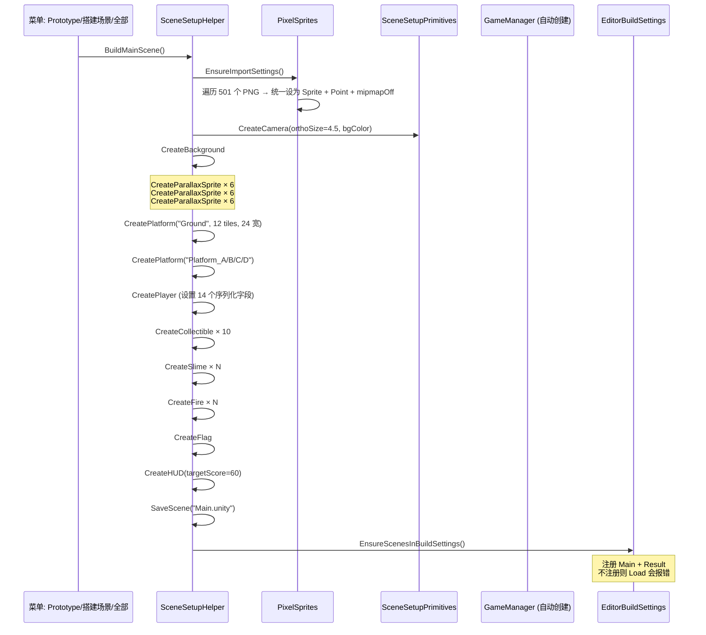
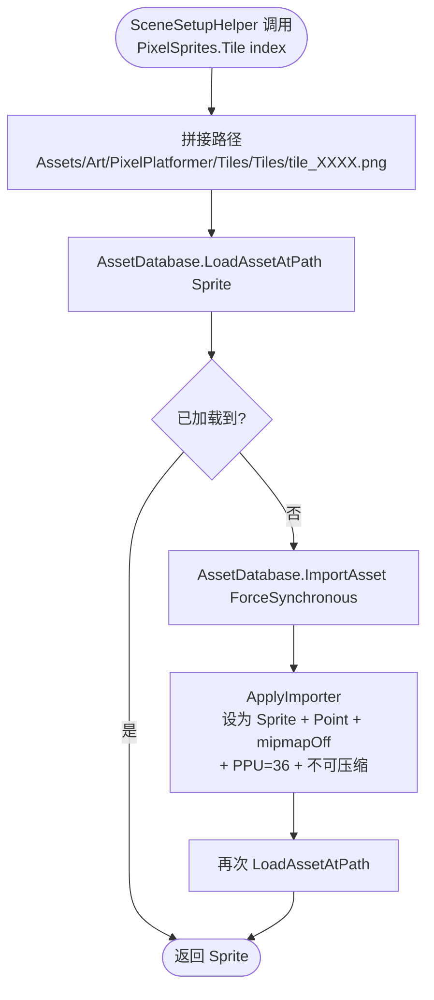
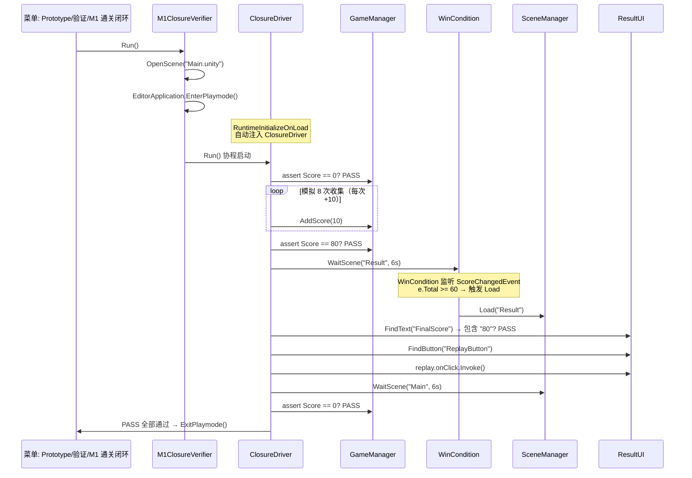

# 06 · 编辑器工具

命名空间：`Prototype.Editor` / `Prototype.Verification`
目录：`Assets/Editor/`
文件数：**7 个**（全部带 `#if UNITY_EDITOR` 条件编译）

这是"让项目跑起来"最关键的部分——因为没有 Prefab 没有 Resources，**所有场景内容都是代码搭建**的。

---

## 文件清单

| 文件 | 命名空间 | 说明 |
|---|---|---|
| SceneSetupHelper.cs | Prototype.Editor | ★ 一键搭建 Main + Result 场景的主入口 |
| SceneSetupPrimitives.cs | Prototype.Editor | 搭建用图元工厂（相机/画布/刚体/精灵对象） |
| PixelSprites.cs | Prototype.Editor | Kenney 素材加载器 + 像素导入设置 + BuildStrip |
| Platformer2DSettings.cs | Prototype.Editor | 首次打开自动切 Default Behavior = 2D |
| AutoTestMenu.cs | Prototype.Editor | 菜单入口：Prototype/自动通关测试 |
| AutoTestLauncher.cs | Prototype.Editor | Play 模式自动启动器（已停用） |
| M1ClosureVerifier.cs | Prototype.Verification | ★ M1 通关闭环验证器 |

---

## 6.1 SceneSetupHelper —— 一键场景搭建

**文件**：`Assets/Editor/SceneSetupHelper.cs`

**菜单入口**：
- `Prototype / 搭建场景 / Main`
- `Prototype / 搭建场景 / Result`
- `Prototype / 搭建场景 / 全部（Main + Result）`


### SceneSetupHelper 搭建时序图


### Main 场景搭建清单

```
Main Camera (正交, orthoSize=4.5, 纯色背景)
  └── Sky（钉在相机上的背景精灵）

（世界根）
  ├── 24 宽主地面 (Platform 12 tiles)
  ├── 边界墙左/右
  ├── Platform_A (y=1, 4 宽, TileSeq=草顶条)
  ├── Platform_B (y=2, 4 宽)
  ├── Platform_C (y=1, 4 宽)
  ├── Platform_D (y=3, 3 宽)
  ├── Player
  │   ├── SpriteRenderer (Kenney CharHero)
  │   ├── BoxCollider2D (0.5x0.62)
  │   ├── Rigidbody2D (冻结旋转)
  │   ├── PlayerController2D (手感参数显式写入)
  │   ├── PlayerHealth
  │   └── AudioSource (Sfx 注入)
  ├── Collectible_1 ~ Collectible_10（10 个，FloatAnim + CircleCollider2D IsTrigger）
  ├── Slime_A / Slime_B (PatrolEnemy, PatrolRange)
  ├── Fire_1 / Fire_2 (FireHazard)
  ├── Flag (FlagGoal)
  ├── Cloud_0 ~ Cloud_5 (Parallax factor=0.55)
  ├── Mountain_L / Mountain_R (Parallax factor=0.9)
  ├── Tree_0 ~ Tree_5 (Parallax factor=0.75)
  ├── CameraFollow2D (挂在 Main Camera)
  ├── LevelConfig (totalCollectibles=10)
  ├── WinCondition (targetScore=60)
  ├── GameManager (DontDestroyOnLoad, 自动创建)
  ├── SceneManager (DontDestroyOnLoad, 自动创建)
  └── AutoTestManager（可选，验证用）

HUD Canvas (Screen Space Overlay)
  ├── ScoreText
  ├── HintText
  ├── ScoreBar + ScoreFill
  ├── Heart_0 / Heart_1 / Heart_2
  ├── ComboText（默认隐藏）
  └── HUD 组件
```

### Result 场景搭建清单

```
Main Camera (与 Main 相同配置)

Result Canvas
  ├── TitleText ("游戏结束")
  ├── FinalScoreText
  ├── CollectText
  ├── StarsText (new string('★', stars) + new string('☆', 3-stars))
  ├── ReplayButton
  └── ResultUI 组件
```

### 关卡数据来源

**M1 关卡**（24x8，10 收集物，通关线 80 分）由 SceneSetupHelper 硬编码：

| 对象 | 坐标 (x, y) | 说明 |
|---|---|---|
| 主地面 | (12, -2), 24 宽 | 全程行走面 |
| Platform A | (6, 1), 4 宽 | 出生后第一跳目标 |
| Platform B | (12, 2), 4 宽 | 中部高台 |
| Platform C | (18, 1), 4 宽 | 右侧中台 |
| Platform D | (21.5, 3), 3 宽 | 右侧高台（探索终点） |
| 出生点 | (2, -1) | 面向右 |
| 终点旗帜 | (22.5, 0) | 触旗通关 |
| 地面收集物 | (3,-0.5), (9,-0.5), (15,-0.5), (21,-0.5) | 4 个 |
| A 平台收集 | (4.5, 1.4), (7.5, 1.4) | 2 个 |
| B 平台收集 | (10.5, 2.4), (13.5, 2.4) | 2 个 |
| C 平台收集 | (18, 1.4) | 1 个 |
| D 平台收集 | (21.5, 3.4) | 1 个 |
| 巡逻史莱姆 | minX/maxX 指定 | minX/maxX 范围巡逻 |
| 火焰陷阱 | 关键位置 | 静态 hazards |

### 创建平台的 CreatePlatform

```csharp
// 传入 tile 序列（如 new[]{0,1,2,3}），BuildStrip 拼成长条纹理
CreatePlatform(string name, Vector3 center, int[] tileSeq):
  → 创建 GameObject + Ground Layer
  → BuildStrip(tileSeq, repeat=22) 生成长条 Sprite
  → BoxCollider2D (width = tileSeq.Length * 0.5, height = 0.5)
  → 附加 SoilVisual（土壤层，增加厚度感）
```

### 关键调用链

```
BuildMainScene:
  → PixelSprites.EnsureImportSettings()      // 保证素材像素锐利
  → CreateCamera()                            // 正交相机
  → CreateBackground(camT)                    // 天空/远山/云/树（视差）
  → CreatePlatform("Ground", center, tiles)   // 主地面
  → CreateWalls()
  → CreatePlatform / CreateSlime / CreateFire / CreateCollectible / CreateFlag / CreatePlayer
  → CreateHUD(targetScore=60)
  → SaveScene("Main.unity")
  → EnsureScenesInBuildSettings()             // 关键！注册进 Build Settings
```

---

## 6.2 SceneSetupPrimitives —— 搭建图元工厂

**文件**：`Assets/Editor/SceneSetupPrimitives.cs`

从 SceneSetupHelper 抽取的通用组装样板，消除重复代码。

| 方法 | 说明 |
|---|---|
| `CreateCamera(orthoSize, bg)` | 正交主相机 + 纯色背景 |
| `CreateCanvas(name)` | ScreenSpaceOverlay Canvas + CanvasScaler + GraphicRaycaster |
| `NewSpriteObject(name, pos, sprite, order)` | 带 SpriteRenderer 的世界对象 |
| `AddFrozenRigidbody(go)` | Rigidbody2D + FreezeRotation |
| `AddScaledSprite(go, size, sprite, order)` | 按 size 缩放 + SpriteRenderer |

---

## 6.3 PixelSprites —— 像素素材加载器

**文件**：`Assets/Editor/PixelSprites.cs`

### 素材来源

[Kenney Pixel Platformer](https://kenney.nl/assets/pixel-platformer) —— **CC0 公共领域**授权，501 个 PNG 文件。

目录：
```
Assets/Art/PixelPlatformer/Tiles/
  ├── Tiles/         # 18x18 地砖
  ├── Characters/    # 24x24 角色帧
  └── Backgrounds/   # 24x24 背景块
```

### PPU 设置

| 类型 | 像素 | PPU | 世界单位 |
|---|---|---|---|
| Tiles | 18×18 | 36 | 0.5 单位/格 |
| Characters | 24×24 | 36 | ≈0.67 单位高 |
| Backgrounds | 24×24 | 24 | 1 单位 |

### 导入设置（自动应用）

```csharp
TextureImporter:
  textureType      = Sprite (2D and UI)
  spriteImportMode = Single
  isReadable       = true          // BuildStrip 需要 Read/Write
  filterMode       = Point         // ★ 像素锐利的关键
  mipmapEnabled    = false
  compression      = Uncompressed
  wrapMode         = Repeat
```

### 静态 API

```csharp
Sprite Tile(int index)   // 加载 tile_XXXX.png（18x18）
Sprite Char(int index)   // 加载角色帧（24x24）
Sprite Bg(int index)     // 加载背景块（24x24）

void EnsureImportSettings()   // 首次调用时批量应用导入设置

Sprite BuildStrip(int[] tileIndexes, int repeat)
// 把 tile 序列循环 repeat 次，拼成一条长条纹理保存到 Assets/Art/Generated/
// 例：BuildStrip(new[]{0,1,2,3}, 22) → 4 tiles × 22 循环 = 88 格长条
```


### PixelSprites 素材加载流程图



### BuildStrip 的实现：BuildStrip 的实现：
1. 创建宽纹理 `Texture2D(width = totalTiles * 18, height = 18)`
2. 逐 tile GetPixels → SetPixels
3. EncodeToPNG → File.WriteAllBytes → 保存到 Assets/Art/Generated/
4. AssetDatabase.ImportAsset → ApplyImporter → 返回 Sprite

这样主地面的 24 宽平台只需要 **1 个 Sprite** 而不是 48 个。

---

## 6.4 Platformer2DSettings —— 2D 模式兜底

**文件**：`Assets/Editor/Platformer2DSettings.cs`

`[InitializeOnLoad]` + 静态构造函数，首次打开工程时自动执行：

```csharp
static Platformer2DSettings()
{
    if (EditorSettings.defaultBehaviorMode != Mode2D)
    {
        EditorSettings.defaultBehaviorMode = EditorBehaviorMode.Mode2D;
    }
}
```

这样 Unity 新建 GameObject 时默认挂 SpriteRenderer 而不是 MeshFilter，与 2D 项目保持一致。SessionState 防止重复执行。

---

## 6.5 AutoTestMenu —— 自动测试入口

**文件**：`Assets/Editor/AutoTestMenu.cs`

菜单：`Prototype / 自动通关测试`

逻辑：
1. 如果不在 Play 模式 → EnterPlaymode → 等 EnteredPlayMode → delayCall TriggerAutoTest
2. 如果已在 Play → 直接 TriggerAutoTest
3. 找到 PlayerController2D → 反射调用 StartAutoTest 方法启动测试

---

## 6.6 M1ClosureVerifier —— 通关闭环验证器

**文件**：`Assets/Editor/M1ClosureVerifier.cs`

**菜单**：`Prototype / 验证 / M1 通关闭环`

这是项目最完整的端到端验证方案。它不是模拟物理行为，而是直接操作 GameManager 数据 + 校验场景切换 + 校验 UI 显示。

### 验证清单

### M1ClosureVerifier 端到端验证时序图



| 步骤 | 校验点 | PASS/FAIL |
|---|---|---|
| 1. 初始状态 | 分数 == 0 | PASS |
| 2. 模拟 8 次 AddScore(10) | 分数 == 80 | PASS |
| 3. 场景切换 | Main → Result（6s 超时） | PASS |
| 4. Result UI | FinalScore 显示 "80" | PASS |
| 5. 点击 Replay | 场景切回 Main | PASS |
| 6. 分数重置 | GameManager.Instance.Score == 0 | PASS |

全部 PASS 输出 `[验证] ==== M1 通关闭环全部通过 ====` 并 ExitPlaymode。
任一 FAIL 输出具体错误并停止验证。

### 实现要点

- `[RuntimeInitializeOnLoadMethod(AfterSceneLoad)]` 在 Play 启动时注入验证协程（避免 EditMode 代码混入 Runtime）
- 用 `DontDestroyOnLoad` 保留验证器跨场景
- 查找 Text/Button 用 `FindObjectsOfType<Text>()` + 按 name 匹配

---

## 编辑器工具一览

| 菜单路径 | 功能 |
|---|---|
| `Prototype / 搭建场景 / Main` | 单独搭建 Main 场景 |
| `Prototype / 搭建场景 / Result` | 单独搭建 Result 场景 |
| `Prototype / 搭建场景 / 全部（Main + Result）` | 一键搭建两个场景 |
| `Prototype / 自动通关测试` | 启动 Play + 进入自动测试模式 |
| `Prototype / 验证 / M1 通关闭环` | ★ 端到端验证（核心验收标准） |
