# 08 · 附录：索引与依赖

## 类索引（按命名空间）

### Prototype.Core

| 类/结构 | 文件 | 类型 | 说明 |
|---|---|---|---|
| MonoSingleton\<T\> | Core/MonoSingleton.cs | abstract class | 泛型单例基类 |
| EventBus | Core/EventBus.cs | static class | 类型安全发布/订阅总线 |
| GameState | Core/Events.cs | enum | Boot/MainMenu/Playing/Paused/GameOver |
| GameStateChangedEvent | Core/Events.cs | readonly struct | 状态切换事件 |
| ScoreChangedEvent | Core/Events.cs | readonly struct | 分数变化事件 |
| LivesChangedEvent | Core/Events.cs | readonly struct | 生命变化事件 |
| SceneLoadedEvent | Core/Events.cs | readonly struct | 场景加载事件 |
| ComboChangedEvent | Core/Events.cs | readonly struct | 连击变化事件 |
| GameManager | Core/GameManager.cs | class : MonoSingleton | 全局状态管理 |
| SceneManager | Core/SceneManager.cs | class : MonoSingleton | 场景加载（与 UnityEngine 重名） |

### Prototype.Gameplay

| 类 | 文件 | RequireComponent | 说明 |
|---|---|---|---|
| PlayerController2D | Gameplay/PlayerController2D.cs | Rigidbody2D | ★ 玩家控制核心 |
| PlayerHealth | Gameplay/PlayerHealth.cs | — | 生命管理 |
| Collectible2D | Gameplay/Collectible2D.cs | — | 可收集物 |
| PatrolEnemy | Gameplay/PatrolEnemy.cs | Rigidbody2D | 巡逻敌人 |
| FireHazard | Gameplay/FireHazard.cs | Collider2D | 火焰陷阱 |
| MovingPlatform | Gameplay/MovingPlatform.cs | BoxCollider2D | 移动平台 |
| FlagGoal | Gameplay/FlagGoal.cs | — | 终点旗帜 |
| CameraFollow2D | Gameplay/CameraFollow2D.cs | — | 相机跟随 |
| Parallax | Gameplay/Parallax.cs | — | 背景视差 |
| FloatAnim | Gameplay/FloatAnim.cs | — | 收集物浮动 |
| SineBobber | Gameplay/SineBobber.cs | —（abstract） | 正弦浮动基类 |
| LevelConfig | Gameplay/LevelConfig.cs | — | 关卡配置 |
| SpriteAnimUtil | Gameplay/SpriteAnimUtil.cs | —（static） | 2 帧动画工具 |
| AutoPlayTest | Gameplay/AutoPlayTest.cs | — | 自动测试（按 T 键） |
| AutoTestUtil | Gameplay/AutoTestUtil.cs | —（static） | 自动测试公共工具 |

### Prototype.UI

| 类 | 文件 | 说明 |
|---|---|---|
| HUD | UI/HUD.cs | 游戏内 UI（Main 场景） |
| ResultUI | UI/ResultUI.cs | 结算界面（Result 场景） |

### Prototype.Effects

| 类 | 文件 | 说明 |
|---|---|---|
| CollectBurst | Effects/CollectBurst.cs | 彩色方块粒子爆发 |
| FloatingText | Effects/FloatingText.cs | 飘分文字（TextMesh） |

### Prototype.Audio

| 类 | 文件 | 说明 |
|---|---|---|
| Sfx | Audio/Sfx.cs | 程序化音效合成（static class） |

### Prototype.Editor

| 类 | 文件 | 说明 |
|---|---|---|
| SceneSetupHelper | Editor/SceneSetupHelper.cs | ★ 一键场景搭建 |
| SceneSetupPrimitives | Editor/SceneSetupPrimitives.cs | 搭建图元工厂 |
| PixelSprites | Editor/PixelSprites.cs | Kenney 素材加载 + BuildStrip |
| Platformer2DSettings | Editor/Platformer2DSettings.cs | 首次打开切 2D 模式 |
| AutoTestMenu | Editor/AutoTestMenu.cs | 自动测试菜单入口 |
| AutoTestLauncher | Editor/AutoTestLauncher.cs | Play 自动启动器（已停用） |

### Prototype.Verification

| 类 | 文件 | 说明 |
|---|---|---|
| M1ClosureVerifier | Editor/M1ClosureVerifier.cs | ★ 通关闭环验证器 |
| ClosureDriver | Editor/M1ClosureVerifier.cs (内部类) | 验证协程执行者 |

---

## 事件索引

| 事件 | 发布者 | 订阅者 | 触发时机 |
|---|---|---|---|
| ScoreChangedEvent | GameManager.AddScore / RegisterCollect | HUD | 每次分数变化 |
| LivesChangedEvent | GameManager.LoseLife / ResetScore | HUD, PlayerHealth(Start) | 每次生命变化 |
| ComboChangedEvent | GameManager.RegisterCollect / Update | HUD | 连击变化 / 归零 |
| GameStateChangedEvent | GameManager.ChangeState | （当前无人订阅） | 游戏状态切换 |
| SceneLoadedEvent | SceneManager.Load/LoadAsync/Reload | （当前无人订阅） | 场景加载完成 |

---



```mermaid
flowchart TD
    subgraph Core ["Core 核心"]
        MS["MonoSingleton&#60;T&#62;"]
        EB["EventBus"]
        GM["GameManager"]
        SM["SceneManager"]
    end

    subgraph Gameplay ["Gameplay 玩法"]
        PC["PlayerController2D"]
        PH["PlayerHealth"]
        C2D["Collectible2D"]
        PE["PatrolEnemy"]
        FH["FireHazard"]
        MP["MovingPlatform"]
        FG["FlagGoal"]
        CF2D["CameraFollow2D"]
        PX["Parallax"]
        FA["FloatAnim"]
        LC["LevelConfig"]
    end

    subgraph UI ["UI 界面"]
        HUD["HUD"]
        RUI["ResultUI"]
    end

    subgraph FX ["Effects + Audio"]
        CB["CollectBurst"]
        FT["FloatingText"]
        SFX["Sfx"]
    end

    %% 继承关系
    GM -.-> MS
    SM -.-> MS

    %% Gameplay → Core
    PC --> SFX
    PH --> GM
    PH --> SM
    C2D --> GM
    C2D --> CB
    C2D --> FT
    C2D --> SFX
    PE --> GM
    PE --> CB
    PE --> FT
    PE --> SFX
    PE --> PH
    FH --> PH
    FG --> GM
    FG --> SM
    FG --> SFX
    LC --> GM

    %% UI → Core
    HUD --> EB
    HUD --> GM
    RUI --> GM

    %% EventBus 订阅方向
    EB -- "Subscribe ScoreChanged" --> HUD
    EB -- "Subscribe LivesChanged" --> HUD
    EB -- "Subscribe LivesChanged" --> PH
    EB -- "Subscribe ComboChanged" --> HUD

    %% 样式
    classDef core fill:#3b82f6,stroke:#1e40af,color:#fff
    classDef gameplay fill:#22c55e,stroke:#15803d,color:#fff
    classDef ui fill:#f59e0b,stroke:#b45309,color:#fff
    classDef fx fill:#a855f7,stroke:#6b21a8,color:#fff

    class MS,EB,GM,SM core
    class PC,PH,C2D,PE,FH,MP,FG,WC,CF2D,PX,FA,LC gameplay
    class HUD,RUI ui
    class CB,FT,SFX fx
```

## 项目 Git 历史摘要

| Commit | 消息 | 主要变化 |
|---|---|---|
| `3c9848e` | feat: 合并 Unity 2D 脚手架框架与一键建场景 | 初始脚手架合并 |
| `02e281b` | docs: 首次运行 checklist | 运行指南 |
| `05efe7c` | fix: 修复首次打开编译错误并生成 M0 场景 | 修复编译 |
| `19228d4` | fix: 修复地面检测射线不限定图层的问题 | groundMask 修复 |
| `05bd4d4` | feat: 搭建 M1 关卡（24x8 布局 + 边界墙 + 80 分通关）并新增关卡设计文档 | ★ M1 关卡主体 |
| `fed9932` | feat: 引入像素素材集 + M2 新功能（FireHazard/MovingPlatform/PatrolEnemy/AutoPlayTest） | ★ M2 功能 + Kenney 素材 |
| `492f22a` | chore: 剔除误 track 的 .bak 备份文件 | gitignore 清理 |
| `b428aa6` | chore: .gitignore 补充 .bak* 和备份目录 | gitignore 完善 |

---

## Unity 内置模块依赖

```json
{
  "dependencies": {
    "com.unity.modules.physics": "1.0.0",
    "com.unity.modules.physics2d": "1.0.0",
    "com.unity.modules.ui": "1.0.0",
    "com.unity.modules.uielements": "1.0.0",
    "com.unity.ugui": "1.0.0",
    "com.unity.modules.audio": "1.0.0",
    "com.unity.modules.animation": "1.0.0",
    "com.unity.modules.particlesystem": "1.0.0",
    "com.unity.modules.imgui": "1.0.0"
  }
}
```

无任何第三方 Unity Package，全部用内置模块。

---

## 关键项目配置文件

| 文件 | 作用 |
|---|---|
| `ProjectSettings/ProjectVersion.txt` | Unity 版本锁定（2022.3.62f3c1） |
| `ProjectSettings/EditorSettings.asset` | DefaultBehaviorMode = 2D |
| `.gitignore` | Unity 缓存 + 备份排除 |
| `Packages/manifest.json` | 内置模块依赖声明 |
| `ProjectSettings/InputManager.asset` | 输入轴配置（Horizontal / Jump） |

---

## 代码规模统计

| 类别 | 文件数 | 命名空间 |
|---|---|---|
| Core（核心框架） | 5 | Prototype.Core |
| Gameplay（玩法逻辑） | 18 | Prototype.Gameplay |
| UI（界面） | 2 | Prototype.UI |
| Effects（特效） | 2 | Prototype.Effects |
| Audio（音效） | 1 | Prototype.Audio |
| Editor（编辑器） | 7 | Prototype.Editor / Prototype.Verification |
| **合计** | **35** | — |

美术资源：Kenney Pixel Platformer CC0 —— **501 个文件**

---

## 课程项目里程碑

| 里程碑 | 时间 | 内容 | 状态 |
|---|---|---|---|
| M0 | 开学季 | Unity 最小场景跑起来 | ✓ 完成 |
| M1 | 10 月 18 日前 | 最小可玩版（移动/跳跃/拾取/通关） | ✓ 完成（05bd4d4） |
| M2 | 11 月底 | 打磨 + 课堂展示 + 可选 itch.io | 进行中（已引入素材和新敌人） |
